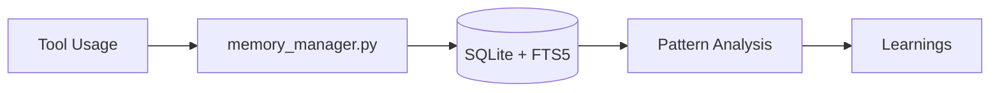

# 🧬 Evolution Core

---
name: evolution-core
description: "Motor de auto-evolução para agentes de IA. Memória persistente e aprendizado sistemático usando SQLite+FTS5 - zero dependências externas."
tags: [meta, ai, self-improvement, core, learning, memory]
version: 2.0.0
---

**"Eu aprendo, evoluo e antecipo suas necessidades."**

O **Evolution Core** é uma skill que transforma um agente de IA em um parceiro que aprende continuamente. Usa SQLite com FTS5 (Full-Text Search) para memória persistente - **sem dependências externas**.

## ✨ Arquitetura Simplificada



| Componente | Script | Função |
|------------|--------|--------|
| **Memória** | `memory_manager.py` | Armazena sessões, observações, mutations |
| **Hooks** | `post_tool_use_hook.py` | Captura uso de ferramentas |
| **Self-Check** | `heartbeat.py` | Análise de padrões e erros |
| **Revisão** | `nightly_review.py` | Agregação de learnings |

---

## 🚀 Quick Start

```bash
# 1. Instalar (verifica Python e SQLite apenas)
bash .agent/skills/evolution-core/scripts/install.sh

# 2. (Opcional) Inicializar manualmente
python3 .agent/skills/evolution-core/scripts/memory_manager.py init
```

**Pronto!** Não precisa rodar workers, não precisa de API keys.

---

## 📦 Comandos Disponíveis

### Memory Manager

```bash
# Inicializar banco de dados
python3 memory_manager.py init

# Carregar contexto histórico
python3 memory_manager.py load_context --project "/path/to/project" --task "descrição"

# Armazenar observação
python3 memory_manager.py store_observation \
    --session-id "uuid" \
    --tool "view_file" \
    --input "/path" \
    --output "content"

# Buscar sessões similares
python3 memory_manager.py query --text "authentication errors"

# Ver estatísticas
python3 memory_manager.py stats
```

### Heartbeat (Self-Check)

```bash
# Executar verificação
python3 heartbeat.py

# Output:
# [Segurança] ✓ Nenhuma anomalia detectada.
# [Auto-Correção] ✓ Nenhum erro crítico encontrado.
# [Proatividade] Ferramentas mais usadas: view_file(42x), grep_search(18x)
# [Memória] Sessões: 15 | Observações: 234 | Learnings: 8
```

### Nightly Review

```bash
# Revisar último dia
python3 nightly_review.py

# Revisar últimos 7 dias
python3 nightly_review.py --days 7

# Preview sem salvar
python3 nightly_review.py --dry-run
```

---

## 💾 Estrutura do Banco de Dados

```
~/.agent/brain/memory.db
├── sessions          # Metadados de sessões
├── observations      # Uso de ferramentas
├── mutations         # Sugestões de melhoria
├── learnings         # Padrões aprendidos
├── context_snapshots # Contexto preservado
└── *_fts            # Tabelas FTS5 para busca semântica
```

---

## 🔧 Integração com Workflows

### No `/plan`
```bash
# Antes de pesquisar, carrega contexto histórico
python3 memory_manager.py load_context --project "$PWD" --task "descrição"
```

### No `/implement`
```bash
# A cada 5 steps, executa checkpoint
python3 heartbeat.py --trigger checkpoint
```

### No `/debug`
```bash
# Após resolver erro, registra solução
python3 memory_manager.py store_observation \
    --session-id "$SESSION" \
    --tool "error_resolution" \
    --input "erro original" \
    --output "solução aplicada"
```

---

## 📁 Estrutura de Arquivos

```
evolution-core/
├── SKILL.md                      # Este arquivo
├── scripts/
│   ├── memory_manager.py         # Core: SQLite + FTS5
│   ├── post_tool_use_hook.py     # Hook para captura
│   ├── heartbeat.py              # Self-check periódico
│   ├── nightly_review.py         # Agregação de learnings
│   ├── install.sh                # Setup script
│   ├── setup_hooks.py            # Configuração de hooks
│   └── ide_configs.json          # Configs para IDEs
└── assets/
    ├── AGENTS.md                 # Template de regras
    ├── MEMORY.md                 # Template de memória
    └── ...                       # Outros templates
```

---

## ⚡ Diferenças da v1.0

| v1.0 (Anterior) | v2.0 (Atual) |
|-----------------|--------------|
| FastAPI + ChromaDB | SQLite + FTS5 |
| Requer worker rodando | CLI direto |
| API externa para LLM | SQL aggregation |
| 5+ dependências pip | Zero dependências |
| Paths hardcoded | Paths dinâmicos |

---

## 🛡️ Segurança

- **Sem chamadas externas**: Tudo roda localmente
- **Dados locais**: Armazenados em `~/.agent/brain/`
- **Fail-safe**: Hooks falham silenciosamente sem bloquear agente
