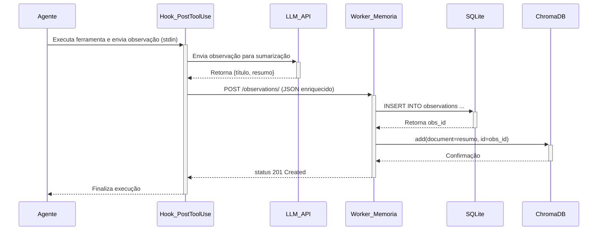

# 📄 Documentação da Arquitetura: Evolution Core

Este documento fornece uma visão aprofundada da arquitetura da skill **Evolution Core**. Para um guia de uso rápido, consulte o arquivo `SKILL.md` principal.

## 1. Visão Geral e Filosofia

A arquitetura do **Evolution Core** é projetada para ser modular e resiliente, baseada em três pilares interdependentes:

1.  **Captura e Armazenamento**: Garante que nenhuma informação seja perdida.
2.  **Aprendizado e Evolução**: Transforma informação em conhecimento e melhoria contínua.
3.  **Comportamento Proativo**: Usa o conhecimento para agregar valor de forma autônoma.

O fluxo de dados é cíclico: o comportamento do agente gera novas observações, que são capturadas e armazenadas. O sistema de aprendizado analisa essa memória para evoluir o comportamento do agente, o que, por sua vez, leva a ações mais inteligentes e proativas.

## 2. Detalhamento dos Componentes

### 2.1. Worker de Memória (`scripts/worker.py`)

O coração do sistema de memória. É um serviço **FastAPI** que fornece uma API para gerenciar o conhecimento do agente.

*   **Tecnologia**: Python, FastAPI, Uvicorn.
*   **Banco de Dados**: 
    *   **SQLite**: Para dados estruturados e metadados. Escolhido pela simplicidade e por não exigir um servidor separado. A tabela `observations` armazena o JSON completo de cada evento capturado.
    *   **ChromaDB**: Para busca de similaridade vetorial. Permite a busca semântica ("encontre-me observações sobre X") em vez de apenas busca por palavra-chave.
*   **Endpoints da API**:
    *   `POST /observations/`: Recebe uma nova observação do hook `PostToolUse`, a processa e a armazena nos dois bancos de dados.
    *   `GET /search/`: Recebe uma query de texto, a vetoriza e a usa para buscar as observações mais relevantes no ChromaDB.
    *   `GET /observations/{obs_id}`: Retorna o JSON completo de uma observação específica, buscando pelo seu ID no SQLite.

### 2.2. Hooks de Ciclo de Vida

São a ponte entre o agente e o sistema de memória. São scripts leves que são acionados em pontos específicos do ciclo de vida do agente.

*   **`post_tool_use_hook.py`**: 
    1.  Acionado após cada uso de ferramenta.
    2.  Recebe o JSON da observação via `stdin`.
    3.  Chama um **LLM (via Perplexity API)** para gerar um título e um resumo semântico da observação. Isso é crucial para a busca semântica posterior.
    4.  Envia o JSON enriquecido para o endpoint `POST /observations/` do worker de memória.
    5.  É projetado para falhar silenciosamente (logando em `/tmp/`) para não interromper o fluxo do agente se o worker ou a API do LLM estiverem indisponíveis.
*   **`heartbeat.py`**: 
    1.  Acionado pelo hook `Stop` (no final de uma interação) ou por um cron.
    2.  Executa o checklist de `HEARTBEAT.md`.
    3.  A lógica de proatividade também usa o LLM para gerar sugestões contextuais.

### 2.3. Scripts de Aprendizado (Batch)

Estes scripts rodam de forma assíncrona para processar a memória e gerar aprendizados de longo prazo.

*   **`nightly_review.py`**: 
    1.  Projetado para ser executado por um **cron job** toda noite.
    2.  Conecta-se ao banco de dados SQLite e busca todas as observações do dia anterior.
    3.  Envia os títulos e resumos para um LLM com um prompt para sintetizar os aprendizados chave do dia.
    4.  Anexa essa síntese ao arquivo `MEMORY.md`, criando um registro contínuo de evolução.

## 3. Fluxo de Dados Detalhado

## 4. Instalação e Dependências

O script `scripts/install.sh` automatiza a configuração do ambiente.

*   **Dependências de Sistema**: `python3-pip`.
*   **Dependências Python**: 
    *   `fastapi` / `uvicorn`: Para o worker de memória.
    *   `chromadb` / `pysqlite3-binary`: Para os bancos de dados.
    *   `requests`: Para a comunicação com a API do LLM.
    *   `python-dotenv`: Para o gerenciamento de chaves de API e configurações.

## 5. Considerações de Design

*   **Modularidade**: Cada componente (worker, hooks, scripts) é independente e se comunica por APIs REST ou chamadas de shell, facilitando a manutenção e a substituição.
*   **Resiliência**: Os hooks são projetados para não travar o agente. Se o sistema de memória estiver offline, o agente continua funcionando, embora sem a capacidade de aprendizado.
*   **Eficiência**: A sumarização no momento da captura (`PostToolUse`) distribui a carga de processamento do LLM ao longo do tempo, em vez de sobrecarregar o sistema durante a revisão noturna. A busca vetorial garante que a recuperação da memória seja rápida, mesmo com um grande volume de dados.
*   **Simplicidade**: O uso de SQLite e ChromaDB (com persistência em arquivo) elimina a necessidade de servidores de banco de dados complexos, tornando a configuração mais simples e portátil.
