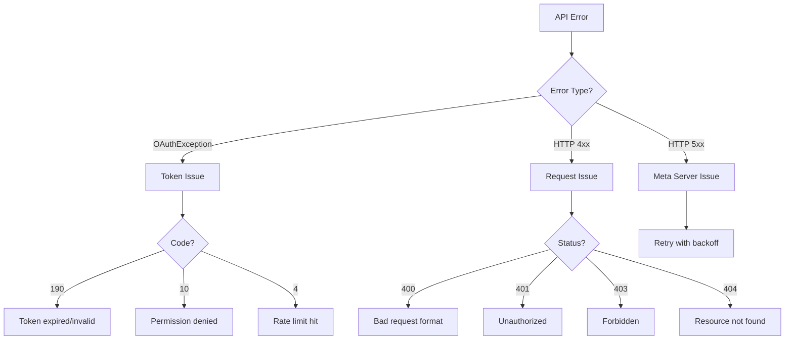

# Troubleshooting Meta API Integrations

> Common errors, debugging tools, and solutions for Meta API issues.

---

## Quick Diagnosis Guide



---

## OAuth & Token Errors

| Error Code | Message | Cause | Solution |
|------------|---------|-------|----------|
| 190 | `Invalid OAuth access token` | Token expired or invalidated | Refresh token or re-authenticate |
| 190 (2500) | `An active access token must be used` | Token expired | Exchange for new long-lived token |
| 10 | `Permission denied` | Missing required scope | Re-authenticate with correct scopes |
| 102 | `Session has expired` | Session timeout | User must re-login |
| 463 | `Token invalidated due to password change` | User changed password | User must re-authenticate |
| 464 | `Token invalidated due to logout` | User logged out | User must re-authenticate |

### Token Expiration Handling

```typescript
async function handleTokenError(error: any, mentoradoId: number) {
  const errorCode = error?.error?.code;

  if (errorCode === 190 || errorCode === 102) {
    // Mark user as disconnected
    await db.update(mentorados).set({
      metaConnected: 'nao',
      metaAccessToken: null,
      updatedAt: new Date(),
    }).where(eq(mentorados.id, mentoradoId));

    throw new Error('Token expired. Please reconnect your account.');
  }

  throw error;
}
```

---

## Rate Limit Errors

| Error Code | Limit Type | Typical Limit |
|------------|------------|---------------|
| 4 | Application rate limit | 200 calls/user/hour |
| 17 | User rate limit | Varies by endpoint |
| 613 | Calls to this API exceeded | Per-endpoint limit |
| 80007 | Business rate limit | Based on tier |

### Exponential Backoff Implementation

```typescript
async function fetchWithRetry(
  url: string,
  options: RequestInit,
  maxRetries = 3
): Promise<Response> {
  let lastError: Error | null = null;

  for (let attempt = 0; attempt < maxRetries; attempt++) {
    try {
      const response = await fetch(url, options);

      if (response.status === 429) {
        // Rate limited - extract retry-after if available
        const retryAfter = response.headers.get('Retry-After');
        const delay = retryAfter ? parseInt(retryAfter) * 1000 : Math.pow(2, attempt) * 1000;

        console.warn(`Rate limited. Retrying in ${delay}ms...`);
        await new Promise(resolve => setTimeout(resolve, delay));
        continue;
      }

      return response;
    } catch (error) {
      lastError = error as Error;
      const delay = Math.pow(2, attempt) * 1000; // 1s, 2s, 4s
      await new Promise(resolve => setTimeout(resolve, delay));
    }
  }

  throw lastError || new Error('Max retries exceeded');
}
```

---

## Webhook Errors

| Issue | Symptom | Solution |
|-------|---------|----------|
| Verification fails | `403 Forbidden` on GET | Check `META_VERIFY_TOKEN` matches exactly |
| Signature mismatch | `Invalid signature` | Ensure raw body parsing, check `APP_SECRET` |
| Event not received | No POST requests | Check webhook subscription in Meta dashboard |
| Webhook disabled | Subscription inactive | Fix server errors, resubscribe |
| Timeout | Meta retries | Return `200 OK` within 20 seconds |

### Debug Webhook Signature

```typescript
function debugSignature(req: Request) {
  const receivedSig = req.headers['x-hub-signature-256'];
  const body = JSON.stringify(req.body);

  console.log('Received signature:', receivedSig);
  console.log('Body length:', body.length);
  console.log('Body preview:', body.substring(0, 100));

  const expectedSig = `sha256=${crypto
    .createHmac('sha256', process.env.META_APP_SECRET!)
    .update(body)
    .digest('hex')}`;

  console.log('Expected signature:', expectedSig);
  console.log('Match:', receivedSig === expectedSig);
}
```

---

## WhatsApp-Specific Errors

| Error Code | Message | Cause | Solution |
|------------|---------|-------|----------|
| 131000 | `Something went wrong` | Generic error | Check payload format |
| 131001 | `Message failed to send` | Invalid phone format | Use international format (5511999999999) |
| 131026 | `Message undeliverable` | User hasn't messaged in 24h | Use template message |
| 131047 | `Re-engagement message` | Outside 24h window | Use approved template |
| 131051 | `Message type not supported` | Invalid message type | Check supported types |
| 132000 | `Template not found` | Template name/language wrong | Verify template exists |
| 133004 | `Phone number not registered` | Number not on WhatsApp | Verify recipient uses WhatsApp |

### Template Message Fallback

```typescript
async function sendMessage(credentials: MetaCredentials, to: string, text: string) {
  try {
    // Try regular message first
    return await sendTextMessage(credentials, to, text);
  } catch (error: any) {
    if (error?.error?.code === 131026 || error?.error?.code === 131047) {
      // Outside 24h window - use template
      console.log('Outside 24h window, falling back to template');
      return await sendTemplateMessage(credentials, to, 'hello_world', 'en');
    }
    throw error;
  }
}
```

---

## Instagram-Specific Errors

| Error Code | Message | Cause | Solution |
|------------|---------|-------|----------|
| 9004 | `Rate limit reached` | Too many API calls | Implement backoff |
| 36003 | `Media type not supported` | Invalid media format | Use JPEG, PNG, MP4 |
| 36004 | `Container creation failed` | Media URL inaccessible | Use publicly accessible URL |
| 9007 | `Account issue` | Account restricted | Check account status |

### Publishing Rate Limits

- **Posts**: 25 per 24 hours
- **Stories**: No official limit (use reasonably)
- **API Calls**: 200 per user per hour

---

## Debugging Tools

### 1. Access Token Debugger

Check token validity, scopes, and expiration:

🔗 [Access Token Debugger](https://developers.facebook.com/tools/debug/accesstoken/)

```bash
# Quick token check via API
curl "https://graph.facebook.com/debug_token?input_token=YOUR_TOKEN&access_token=APP_ID|APP_SECRET"
```

### 2. Graph API Explorer

Test API calls interactively:

🔗 [Graph API Explorer](https://developers.facebook.com/tools/explorer/)

### 3. Webhook Testing

Test webhook payloads locally:

```bash
# Forward webhooks to localhost using ngrok
ngrok http 3000

# Then update Meta webhook URL temporarily
```

### 4. WhatsApp Test Phone Number

Use Meta's test phone number for development:
- Phone Number ID: Provided in WhatsApp API Setup
- Allows testing without business verification

---

## Error Logging Best Practices

```typescript
function logApiError(context: string, error: any) {
  console.error(`[Meta API Error] ${context}:`, {
    timestamp: new Date().toISOString(),
    code: error?.error?.code,
    type: error?.error?.type,
    message: error?.error?.message,
    fbtrace_id: error?.error?.fbtrace_id, // Useful for Meta support
    subcode: error?.error?.error_subcode,
  });
}

// Usage
try {
  await sendMessage(credentials, phone, text);
} catch (error) {
  logApiError('sendMessage', error);
  throw error;
}
```

---

## Common Fixes Checklist

```yaml
Token Issues:
  - [ ] Check token not expired (Access Token Debugger)
  - [ ] Verify token has required scopes
  - [ ] Ensure token is for correct app/user
  - [ ] Try generating new token

Permission Issues:
  - [ ] Review app permissions in Meta Dashboard
  - [ ] Complete App Review if needed
  - [ ] Check user has approved required scopes
  - [ ] Verify business account is active

Webhook Issues:
  - [ ] Verify META_VERIFY_TOKEN matches
  - [ ] Check server returns 200 within 20s
  - [ ] Validate signature calculation
  - [ ] Ensure HTTPS with valid certificate

WhatsApp Issues:
  - [ ] Verify phone number format (no + prefix)
  - [ ] Check 24h messaging window
  - [ ] Use templates for re-engagement
  - [ ] Verify phone number is active
```

---

## Getting Support

1. **Meta Developer Support**: [developers.facebook.com/support](https://developers.facebook.com/support/)
2. **Community Forum**: [developers.facebook.com/community](https://developers.facebook.com/community/)
3. **Stack Overflow**: Tag `facebook-graph-api` or `whatsapp-cloud-api`
4. **Log `fbtrace_id`**: Include in support tickets for faster resolution
