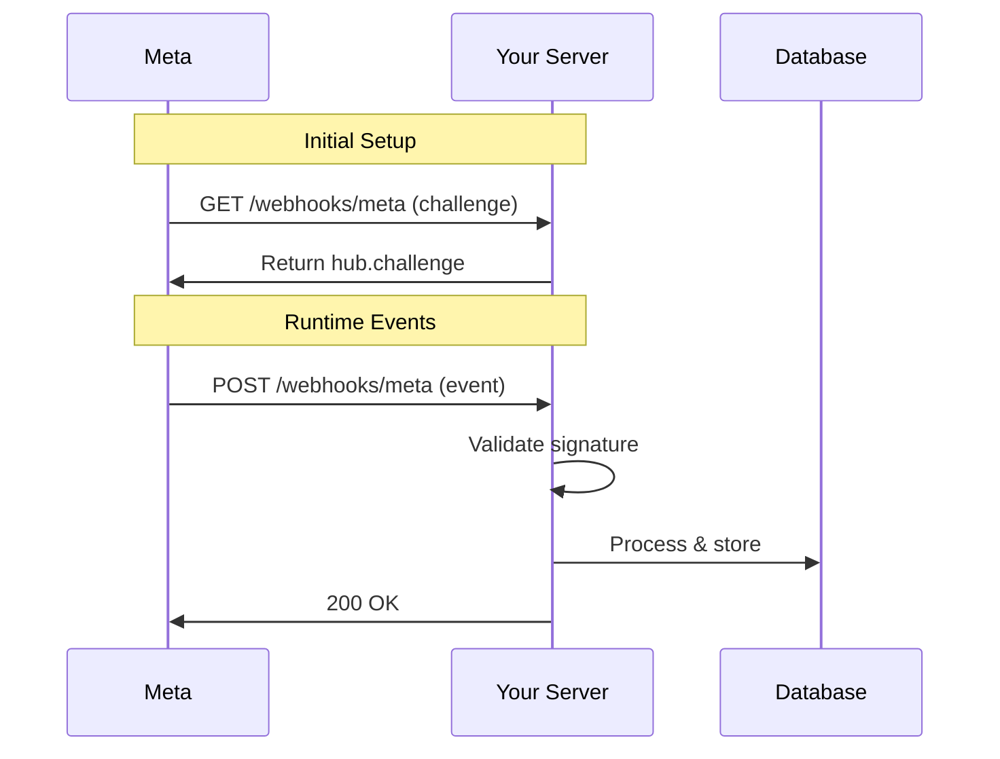

# Webhook Setup for Meta APIs

> Configuration guide for receiving real-time events from WhatsApp and Instagram via webhooks.

---

## Webhook Architecture



---

## Step 1: Challenge Verification (GET Endpoint)

Meta requires a verification endpoint before enabling webhooks:

```typescript
// server/webhooks/metaWebhook.ts
import { Router, Request, Response } from 'express';

const router = Router();

const VERIFY_TOKEN = process.env.META_VERIFY_TOKEN!;

router.get('/webhooks/meta/whatsapp', (req: Request, res: Response) => {
  const mode = req.query['hub.mode'];
  const token = req.query['hub.verify_token'];
  const challenge = req.query['hub.challenge'];

  if (mode === 'subscribe' && token === VERIFY_TOKEN) {
    console.log('Webhook verified successfully');
    return res.status(200).send(challenge);
  }

  console.error('Webhook verification failed');
  return res.status(403).send('Forbidden');
});

export default router;
```

---

## Step 2: Signature Validation

**⚠️ Critical Security Step**: Always validate the signature before processing.

```typescript
import crypto from 'crypto';

const APP_SECRET = process.env.META_APP_SECRET!;

function validateSignature(req: Request): boolean {
  const signature = req.headers['x-hub-signature-256'] as string;

  if (!signature) {
    console.error('Missing X-Hub-Signature-256 header');
    return false;
  }

  const expectedSignature = `sha256=${crypto
    .createHmac('sha256', APP_SECRET)
    .update(JSON.stringify(req.body))
    .digest('hex')}`;

  const isValid = crypto.timingSafeEqual(
    Buffer.from(signature),
    Buffer.from(expectedSignature)
  );

  if (!isValid) {
    console.error('Invalid webhook signature');
  }

  return isValid;
}
```

---

## Step 3: Handle Webhook Events (POST Endpoint)

```typescript
interface MetaWebhookPayload {
  object: 'whatsapp_business_account' | 'instagram';
  entry: Array<{
    id: string;
    time: number;
    changes: Array<{
      field: string;
      value: any;
    }>;
  }>;
}

router.post('/webhooks/meta/whatsapp', async (req: Request, res: Response) => {
  // 1. Validate signature
  if (!validateSignature(req)) {
    return res.status(403).send('Invalid signature');
  }

  const body = req.body as MetaWebhookPayload;

  // 2. Acknowledge immediately (Meta expects 200 within 20 seconds)
  res.status(200).send('OK');

  // 3. Process asynchronously
  try {
    await processWebhookPayload(body);
  } catch (error) {
    console.error('Webhook processing error:', error);
    // Don't throw - we already sent 200
  }
});

async function processWebhookPayload(payload: MetaWebhookPayload) {
  if (payload.object !== 'whatsapp_business_account') {
    return;
  }

  for (const entry of payload.entry) {
    for (const change of entry.changes) {
      if (change.field === 'messages') {
        await handleMessages(change.value);
      }
    }
  }
}
```

---

## Step 4: Message Event Handling

### Inbound Message Structure

```typescript
interface WhatsAppMessageValue {
  messaging_product: 'whatsapp';
  metadata: {
    display_phone_number: string;
    phone_number_id: string;
  };
  contacts?: Array<{
    profile: { name: string };
    wa_id: string;
  }>;
  messages?: Array<{
    id: string;
    from: string;
    timestamp: string;
    type: 'text' | 'image' | 'audio' | 'video' | 'document' | 'interactive';
    text?: { body: string };
  }>;
  statuses?: Array<{
    id: string;
    status: 'sent' | 'delivered' | 'read' | 'failed';
    timestamp: string;
    recipient_id: string;
  }>;
}

async function handleMessages(value: WhatsAppMessageValue) {
  const phoneNumberId = value.metadata.phone_number_id;

  // Find mentorado by phone number ID
  const mentorado = await db.query.mentorados.findFirst({
    where: eq(mentorados.metaPhoneNumberId, phoneNumberId),
  });

  if (!mentorado) {
    console.warn(`No mentorado found for phone ${phoneNumberId}`);
    return;
  }

  // Process incoming messages
  if (value.messages) {
    for (const message of value.messages) {
      await db.insert(whatsappMessages).values({
        mentoradoId: mentorado.id,
        externalMessageId: message.id,
        phone: message.from,
        direction: 'inbound',
        content: message.text?.body ?? '[Media]',
        status: 'received',
        createdAt: new Date(parseInt(message.timestamp) * 1000),
      });
    }
  }

  // Process status updates
  if (value.statuses) {
    for (const status of value.statuses) {
      await db.update(whatsappMessages)
        .set({ status: status.status, updatedAt: new Date() })
        .where(eq(whatsappMessages.externalMessageId, status.id));
    }
  }
}
```

---

## Webhook Payload Examples

### Text Message Received

```json
{
  "object": "whatsapp_business_account",
  "entry": [{
    "id": "WABA_ID",
    "changes": [{
      "field": "messages",
      "value": {
        "messaging_product": "whatsapp",
        "metadata": {
          "display_phone_number": "+1234567890",
          "phone_number_id": "PHONE_NUMBER_ID"
        },
        "contacts": [{
          "profile": { "name": "John Doe" },
          "wa_id": "5511999999999"
        }],
        "messages": [{
          "id": "wamid.xxx",
          "from": "5511999999999",
          "timestamp": "1677777777",
          "type": "text",
          "text": { "body": "Hello!" }
        }]
      }
    }]
  }]
}
```

### Message Status Update

```json
{
  "object": "whatsapp_business_account",
  "entry": [{
    "id": "WABA_ID",
    "changes": [{
      "field": "messages",
      "value": {
        "messaging_product": "whatsapp",
        "metadata": {
          "display_phone_number": "+1234567890",
          "phone_number_id": "PHONE_NUMBER_ID"
        },
        "statuses": [{
          "id": "wamid.xxx",
          "status": "delivered",
          "timestamp": "1677777780",
          "recipient_id": "5511999999999"
        }]
      }
    }]
  }]
}
```

---

## Meta Business Manager Configuration

1. Go to **Meta App Dashboard** → **Webhooks**
2. Click **Add Subscription** for "WhatsApp Business Account"
3. Enter your callback URL: `https://yourdomain.com/webhooks/meta/whatsapp`
4. Enter your verify token: (same as `META_VERIFY_TOKEN`)
5. Subscribe to fields:
   - `messages` (required)
   - `message_template_status_update` (optional)

---

## Retry Policy

Meta webhooks have automatic retry:

| Attempt | Delay |
|---------|-------|
| 1 | Immediate |
| 2 | 15 minutes |
| 3 | 1 hour |
| 4 | 6 hours |
| 5 | 24 hours |
| 6-7 | 24 hours each |

> ⚠️ After 7 days of failures, the webhook subscription is disabled.

---

## Best Practices

1. **Always return 200 OK quickly** (within 20 seconds)
2. **Process asynchronously** after acknowledging
3. **Validate signatures** on every request
4. **Implement idempotency** (check for duplicate message IDs)
5. **Log all payloads** for debugging
6. **Monitor for failures** to prevent subscription disabling

---

## Troubleshooting

| Issue | Solution |
|-------|----------|
| Challenge verification fails | Check `META_VERIFY_TOKEN` matches exactly |
| Signature validation fails | Ensure `META_APP_SECRET` is correct; check raw body parsing |
| Events not received | Verify webhook subscription is active in Meta dashboard |
| Duplicate events | Implement deduplication by message ID |
| Webhook disabled | Check server logs, fix errors, resubscribe |
