# Self-Evolving Agent Skill

> **Vision**: An AI agent that learns from every interaction, preserves critical context across sessions, and continuously improves its own performance through systematic analysis and mutation.

## Overview

This skill implements a three-pillar architecture for autonomous agent improvement:

```mermaid
graph TB
    subgraph "Three Pillars"
        L[🧠 Learning<br/>Runtime Analysis]
        S[💾 Storage<br/>Permanent Memory]
        P[⚡ Proactivity<br/>Context Survival]
    end
    
    L --> |"Patterns"| S
    S --> |"History"| L
    P --> |"Snapshots"| S
    S --> |"Retrieval"| P
    L --> |"Mutations"| P
```



| Pillar | Component | Purpose |
|--------|-----------|---------|
| **Learning** | `evolution_engine.py` | Analyze runtime patterns, detect inefficiencies, generate mutations |
| **Storage** | `memory_manager.py` | SQLite + FTS5 for permanent session/observation storage |
| **Proactivity** | `context_preserver.py` | Pre-compaction flush, critical fact extraction |

---

## When to Use (Automatic Activation)

| Trigger | Action | Script |
|---------|--------|--------|
| **Session Start** | Load compressed context from previous sessions | `memory_manager.py load_context` |
| **Post-Error** | Analyze failure patterns, suggest corrections | `evolution_engine.py analyze_failure` |
| **Planning Phase** | Review historical decisions and outcomes | `learning_analyzer.py query_patterns` |
| **Every 5 Implementation Steps** | Checkpoint progress, validate approach | `evolution_engine.py checkpoint_progress` |
| **Pre-Compaction** | Flush critical facts before summarization | `context_preserver.py flush_critical_facts` |
| **Session End** | Compress and store session summary | `memory_manager.py compress_session` |

---

## Architecture

### Data Flow


### Storage Schema

```
.agent/brain/
├── memory.db              # SQLite database
│   ├── sessions           # Session metadata + embeddings
│   ├── observations       # Tool usage logs
│   ├── mutations          # Generated improvements
│   ├── learnings          # Cross-project patterns
│   └── context_snapshots  # Pre-compaction saves
└── {session_id}/
    └── context_snapshot.md  # Human-readable snapshot
```

---

## Workflows

### 1. Session Initialization

```bash
# Automatic at session start
python3 .agent/skills/self-evolving-agent/scripts/memory_manager.py load_context \
    --project "$PWD" \
    --task "Current task description"
```

**Output**: Compressed context from similar past sessions injected into agent memory.

### 2. Runtime Observation

```python
# Call after each significant tool usage
memory_manager.store_observation(
    session_id="current-session-uuid",
    tool_name="view_file",
    input_data="/path/to/file.ts",
    output_data="<file contents>",
    context_snapshot="Working on feature X"
)
```

### 3. Pre-Compaction Flush

When context window approaches limits:

```bash
python3 .agent/skills/self-evolving-agent/scripts/context_preserver.py flush \
    --session-id "$SESSION_ID" \
    --conversation "<current conversation transcript>"
```

**Critical Facts Extracted**:
- Current task state and progress
- Key decisions made and rationale
- Unresolved issues or blockers
- Important file paths and code references

### 4. Evolution Analysis

```bash
# Every 5 implementation steps
python3 .agent/skills/self-evolving-agent/scripts/evolution_engine.py checkpoint \
    --session-id "$SESSION_ID"
```

**Analysis Outputs**:
- Inefficiency detection (redundant operations, slow patterns)
- Mutation suggestions with confidence scores
- Performance metrics (token usage, execution time)

### 5. Cross-Project Learning

```bash
# Periodic aggregation across all projects
python3 .agent/skills/self-evolving-agent/scripts/learning_analyzer.py aggregate \
    --scan-path "/home/mauricio"
```

---

## Safety Protocols

| Mechanism | Implementation | Purpose |
|-----------|----------------|---------|
| **Mutation Approval** | `require_confirmation=True` | No autonomous mutations without user consent |
| **Confidence Threshold** | `min_confidence=0.8` | Only suggest high-confidence improvements |
| **Rollback Support** | `store_pre_mutation_state()` | Easy reversion if mutation fails |
| **Rate Limiting** | `max_mutations=3/session` | Prevent instability from too many changes |
| **Recursion Guard** | `max_depth=3` | Prevent infinite analysis loops |

### Mutation Approval Flow


---

## Integration Points

### Enhanced `/plan` Workflow

Before research phase, the skill automatically:
1. Queries `memory_manager` for similar past planning tasks
2. Retrieves relevant observations and learnings
3. Injects compressed context into planning phase
4. Suggests proven approaches based on historical success

### Enhanced `/implement` Workflow

Every 5 implementation steps:
1. Captures current implementation state
2. Analyzes for inefficiencies or anti-patterns
3. Suggests optimizations if confidence > 80%
4. Stores observations for future learning

### Enhanced `/debug` Workflow

After any error:
1. Analyzes error pattern against historical data
2. Suggests solutions that worked before
3. Stores error-solution pair for future reference
4. Updates mutation strategies to prevent recurrence

---

## Usage Examples

### Query Historical Context

```python
# Natural language query against stored sessions
results = memory_manager.query_similar_sessions(
    query="How did I handle authentication errors before?",
    limit=5
)
```

### Suggest Improvements

```python
# After implementing a feature
mutations = evolution_engine.analyze_runtime_history(session_id)
for mutation in mutations:
    if mutation.confidence > 0.8:
        print(f"Suggestion: {mutation.strategy}")
        print(f"Confidence: {mutation.confidence}")
        print(f"Based on: {mutation.historical_success_count} similar cases")
```

### Preserve Critical Context

```python
# Before context summarization
critical_facts = context_preserver.extract_critical_facts(conversation)
context_preserver.flush_to_snapshot(session_id, critical_facts)
```

---

## Configuration

See `assets/config.yaml` for full configuration options:

```yaml
storage:
  database_path: ".agent/brain/memory.db"
  vector_db_type: "sqlite_fts5"
  compression_enabled: true
  
evolution:
  confidence_threshold: 0.8
  max_mutations_per_session: 3
  analysis_frequency: 5  # steps
  
context:
  max_context_tokens: 8000
  retrieval_limit: 5
  temporal_decay_factor: 0.9
```

---

## Scripts Reference

| Script | Purpose | Key Functions |
|--------|---------|---------------|
| `memory_manager.py` | Persistent storage | `init_database()`, `load_context()`, `store_observation()`, `compress_session()` |
| `evolution_engine.py` | Pattern analysis | `analyze_runtime_history()`, `detect_inefficiencies()`, `generate_mutations()` |
| `context_preserver.py` | Context survival | `extract_critical_facts()`, `flush_to_snapshot()`, `load_snapshot()` |
| `learning_analyzer.py` | Cross-project | `aggregate_patterns()`, `suggest_skill_creation()`, `propose_agents_md_updates()` |

---

## Continuous Improvement Loop

```mermaid
graph TB
    O[👁️ Observe<br/>Capture tool usage] --> A[🔍 Analyze<br/>Identify patterns]
    A --> M[🧬 Mutate<br/>Generate suggestions]
    M --> V[✅ Validate<br/>Measure outcomes]
    V --> L[📚 Learn<br/>Aggregate patterns]
    L --> E[🚀 Evolve<br/>Update skill itself]
    E --> O
```



The skill implements meta-learning by analyzing its own effectiveness and proposing updates to its own configuration and strategies based on observed outcomes.
