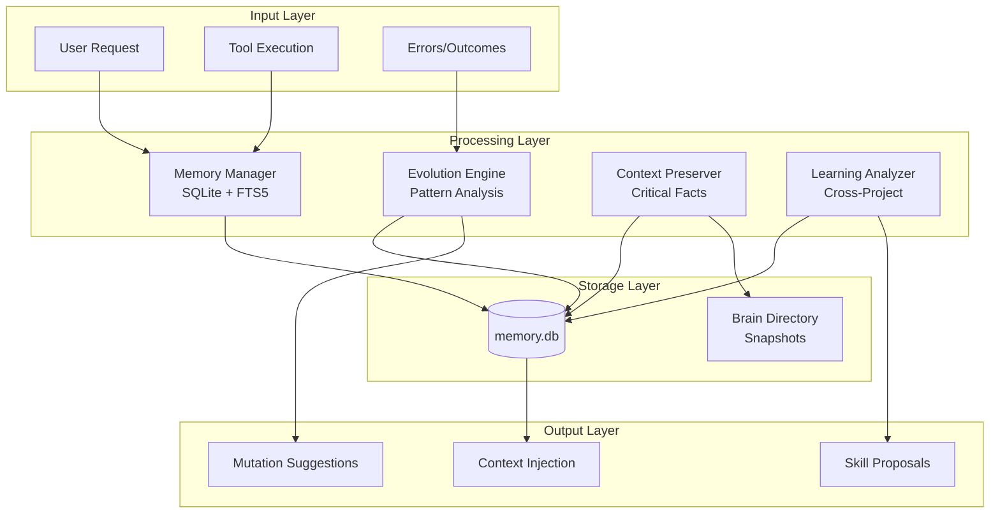
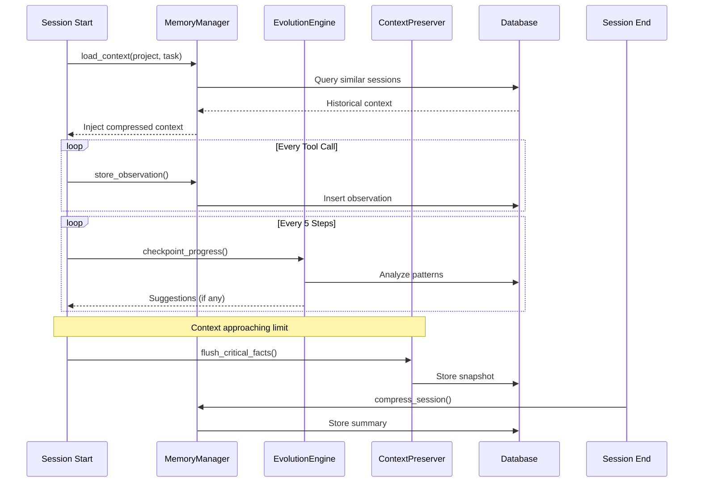
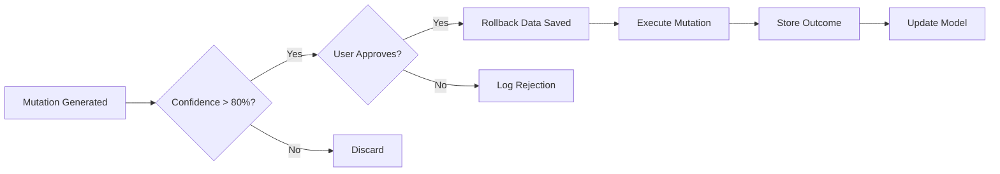

# Self-Evolving Agent Architecture

## System Overview

The self-evolving agent implements a three-pillar architecture for autonomous improvement:



## Component Interaction

### Session Lifecycle



## Data Flow

### Observation Capture

```
Tool Execution
    │
    ▼
┌─────────────────────────────┐
│ store_observation()         │
│ - tool_name                 │
│ - input_data (truncated)    │
│ - output_data (truncated)   │
│ - context_snapshot          │
│ - execution_time_ms         │
│ - success flag              │
└─────────────────────────────┘
    │
    ▼
┌─────────────────────────────┐
│ SQLite: observations table  │
│ + FTS5: observations_fts    │
└─────────────────────────────┘
```

### Context Retrieval

```
New Session Start
    │
    ▼
┌─────────────────────────────┐
│ load_context(project, task) │
│                             │
│ 1. Query by project_path    │
│ 2. FTS5 semantic search     │
│ 3. Merge & deduplicate      │
│ 4. Load high-conf learnings │
└─────────────────────────────┘
    │
    ▼
┌─────────────────────────────┐
│ Return:                     │
│ - similar_sessions[]        │
│ - relevant_learnings[]      │
│ - suggested_approaches[]    │
└─────────────────────────────┘
```

## Storage Architecture

### SQLite Schema

```
┌──────────────────────────────────────────────────────────────┐
│ sessions                                                      │
├──────────────────────────────────────────────────────────────┤
│ session_id TEXT PK                                           │
│ project_path TEXT NOT NULL                                   │
│ start_time TIMESTAMP                                         │
│ end_time TIMESTAMP                                           │
│ summary TEXT                                                 │
│ token_usage INTEGER                                          │
│ success_score REAL                                           │
└──────────────────────────────────────────────────────────────┘
         │
         │ 1:N
         ▼
┌──────────────────────────────────────────────────────────────┐
│ observations                                                  │
├──────────────────────────────────────────────────────────────┤
│ observation_id TEXT PK                                       │
│ session_id TEXT FK                                           │
│ timestamp TIMESTAMP                                          │
│ tool_name TEXT                                               │
│ input_data TEXT                                              │
│ output_data TEXT                                             │
│ context_snapshot TEXT                                        │
│ execution_time_ms INTEGER                                    │
│ success BOOLEAN                                              │
└──────────────────────────────────────────────────────────────┘

┌──────────────────────────────────────────────────────────────┐
│ mutations                                                     │
├──────────────────────────────────────────────────────────────┤
│ mutation_id TEXT PK                                          │
│ session_id TEXT FK                                           │
│ inefficiency_type TEXT                                       │
│ mutation_strategy TEXT (JSON)                                │
│ confidence_score REAL                                        │
│ applied BOOLEAN                                              │
│ outcome TEXT                                                 │
│ rollback_data TEXT                                           │
└──────────────────────────────────────────────────────────────┘

┌──────────────────────────────────────────────────────────────┐
│ learnings                                                     │
├──────────────────────────────────────────────────────────────┤
│ learning_id TEXT PK                                          │
│ pattern_type TEXT                                            │
│ description TEXT                                             │
│ frequency INTEGER                                            │
│ confidence_score REAL                                        │
│ cross_project_refs TEXT (JSON)                               │
│ source_sessions TEXT (JSON)                                  │
└──────────────────────────────────────────────────────────────┘

┌──────────────────────────────────────────────────────────────┐
│ context_snapshots                                             │
├──────────────────────────────────────────────────────────────┤
│ snapshot_id TEXT PK                                          │
│ session_id TEXT FK                                           │
│ timestamp TIMESTAMP                                          │
│ compressed_context TEXT (JSON)                               │
│ retrieval_priority INTEGER                                   │
│ critical_facts TEXT (JSON)                                   │
└──────────────────────────────────────────────────────────────┘
```

### FTS5 Virtual Tables

Full-text search enabled on:
- `sessions_fts` → summary, task_description
- `observations_fts` → tool_name, context_snapshot
- `learnings_fts` → pattern_type, description

## Integration Points

### Workflow Enhancement

| Workflow | Integration | Trigger |
|----------|-------------|---------|
| `/plan` | Historical context injection | Phase 0.5 |
| `/implement` | Checkpoint progress | Every 5 steps |
| `/debug` | Error pattern lookup | Post-error |

### MCP Tool Hooks (Future)

```python
# Hypothetical integration
@on_tool_execute
def capture_observation(tool_name, input, output, success):
    memory_manager.store_observation(
        session_id=current_session,
        tool_name=tool_name,
        input_data=str(input),
        output_data=str(output),
        success=success
    )
```

## Safety Architecture



### Rate Limiting

- Max 3 mutations per session
- Max recursion depth: 3
- Minimum confidence: 80%

## File System Layout

```
~/.agent/
├── brain/
│   ├── memory.db              # Main SQLite database
│   └── {session-id}/
│       └── context_snapshot.md  # Human-readable snapshot
└── skills/
    └── self-evolving-agent/
        ├── SKILL.md
        ├── scripts/
        │   ├── memory_manager.py
        │   ├── evolution_engine.py
        │   ├── context_preserver.py
        │   └── learning_analyzer.py
        ├── references/
        │   ├── architecture.md
        │   ├── storage_schema.md
        │   └── evolution_strategies.md
        └── assets/
            ├── init_db.sql
            └── config.yaml
```
