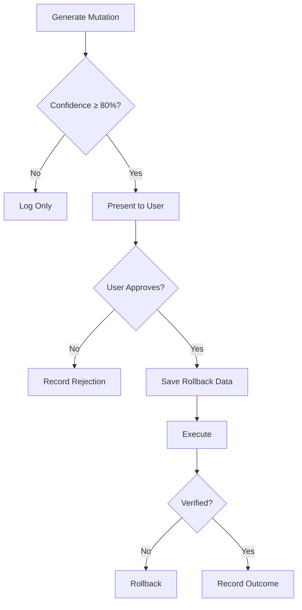

# Evolution Strategies Reference

## Inefficiency Types

### REDUNDANT_FILE_READS

**Description**: Same file is read multiple times within a session.

**Detection**:
```python
file_counts = Counter(obs["input_data"] for obs in file_reads)
if file_counts[path] > 2:
    # Inefficiency detected
```

**Mutation Strategy**: `CACHE_FILE_CONTENT`
- Keep file content in memory after first read
- Use cached version for subsequent access
- Invalidate cache on file modification

**Severity Calculation**: `min(read_count / 5, 1.0)`

---

### REPEATED_ERRORS

**Description**: Same operation fails multiple times without changing approach.

**Detection**:
```python
error_inputs = Counter(obs["input_data"] for obs in errors)
if error_inputs[input] > 1:
    # Pattern detected
```

**Mutation Strategy**: `ERROR_PATTERN_LOOKUP`
- Before retrying, check historical error database
- Suggest alternative approaches that worked before
- Prevent repeating known failures

**Severity Calculation**: `min(error_count / 3, 1.0)`

---

### CIRCULAR_NAVIGATION

**Description**: Agent navigates back and forth between same files repeatedly.

**Detection**:
```python
# Pattern: A -> B -> A -> B
if window[0] == window[2] and window[1] == window[3]:
    # Circular pattern detected
```

**Mutation Strategy**: `SMARTER_NAVIGATION`
- Load both files at once
- Analyze together before making changes
- Reduce context switches

**Severity**: 0.6 (fixed)

---

### EXCESSIVE_SEARCHES

**Description**: Too many search operations in a single session.

**Detection**:
```python
searches = [obs for obs in observations if obs["tool_name"] in search_tools]
if len(searches) > 10:
    # Excessive
```

**Mutation Strategy**: `TARGETED_SEARCH`
- Use more specific search queries
- Cache and reuse search results
- Consider building an index

**Severity Calculation**: `min(search_count / 20, 1.0)`

---

### RETRY_WITHOUT_CHANGE

**Description**: Same tool called with identical input after failure.

**Detection**:
```python
if prev["tool_name"] == curr["tool_name"] and
   prev["input_data"] == curr["input_data"] and
   not prev["success"]:
    # Retry without change
```

**Mutation Strategy**: `VERIFY_BEFORE_RETRY`
- Require verification of fix before retrying
- Suggest diagnostic steps
- Force approach change

**Severity**: 0.7 (fixed)

---

## Mutation Strategies

### CACHE_FILE_CONTENT

```json
{
    "action": "cache_file_content",
    "details": "Cache file content in memory",
    "file_path": "/path/to/file.ts",
    "estimated_savings": "3 file reads"
}
```

**Implementation Notes**:
- Use LRU cache with configurable size
- Track file modification times
- Invalidate on write operations

---

### ERROR_PATTERN_LOOKUP

```json
{
    "action": "error_pattern_lookup",
    "details": "Check error history before attempting",
    "error_signature": "view_file:invalid_path",
    "estimated_savings": "2 failed attempts"
}
```

**Implementation Notes**:
- Query learnings table for similar errors
- Present historical solutions
- Track which solutions worked

---

### SMARTER_NAVIGATION

```json
{
    "action": "smarter_navigation",
    "details": "Load both files at once and analyze together",
    "affected_files": ["file1.ts", "file2.ts"],
    "estimated_savings": "50% navigation overhead"
}
```

**Implementation Notes**:
- Detect related files (imports, references)
- Suggest batch loading
- Provide composite view

---

### TARGETED_SEARCH

```json
{
    "action": "targeted_search",
    "details": "Use more specific search queries",
    "search_count": 15,
    "estimated_savings": "Reduced cognitive load"
}
```

**Implementation Notes**:
- Analyze failed searches
- Suggest query refinements
- Consider codebase_search over grep

---

### VERIFY_BEFORE_RETRY

```json
{
    "action": "verify_before_retry",
    "details": "Verify fix before retrying operation",
    "failed_tool": "run_command",
    "estimated_savings": "Prevent futile retries"
}
```

**Implementation Notes**:
- Require explicit verification step
- Show what needs to change
- Block identical retries

---

## Confidence Scoring

### Base Confidence

Derived from inefficiency severity:
- Severity ≥ 0.8 → High confidence
- Severity 0.5-0.8 → Medium confidence
- Severity < 0.5 → Low confidence (discard)

### Historical Adjustment

```python
def calculate_confidence(mutation, historical_mutations):
    base = mutation["confidence_score"]
    
    similar = [m for m in historical_mutations 
               if m["inefficiency_type"] == mutation["inefficiency_type"]
               and m["applied"]]
    
    if similar:
        success_rate = sum(1 for m in similar if m["outcome"] == "success") / len(similar)
        return (base + success_rate) / 2
    
    return base
```

### Thresholds

| Confidence | Action |
|------------|--------|
| < 0.5 | Discard mutation |
| 0.5 - 0.8 | Log for future analysis |
| ≥ 0.8 | Present to user |

---

## Safety Guardrails

### Rate Limiting

```python
MAX_MUTATIONS_PER_SESSION = 3
CONFIDENCE_THRESHOLD = 0.8
MAX_RECURSION_DEPTH = 3
```

### Rollback Support

Before applying any mutation:
1. Store current state in `rollback_data`
2. Apply mutation
3. Verify outcome
4. If failure, rollback using stored data

### Approval Flow



---

## Learning Evolution

### Pattern Frequency Tracking

```sql
-- Increment frequency on pattern reoccurrence
UPDATE learnings
SET frequency = frequency + 1,
    updated_at = CURRENT_TIMESTAMP
WHERE pattern_type = ?;
```

### Confidence Adjustment

```sql
-- Adjust confidence based on mutation outcomes
UPDATE learnings
SET confidence_score = (confidence_score + ?) / 2
WHERE learning_id = ?;
```

### Cross-Project Propagation

When a pattern succeeds in multiple projects:
1. Increase confidence score
2. Add to cross_project_refs
3. Consider for skill extraction

---

## Skill Extraction Criteria

A pattern should be extracted to a skill when:

| Criterion | Threshold |
|-----------|-----------|
| Frequency | ≥ 5 occurrences |
| Confidence | ≥ 0.8 |
| Projects | ≥ 2 different projects |
| Complexity | > 3 steps in workflow |

```python
def should_extract_skill(learning):
    return (
        learning["frequency"] >= 5 and
        learning["confidence_score"] >= 0.8 and
        len(json.loads(learning["cross_project_refs"])) >= 2
    )
```
