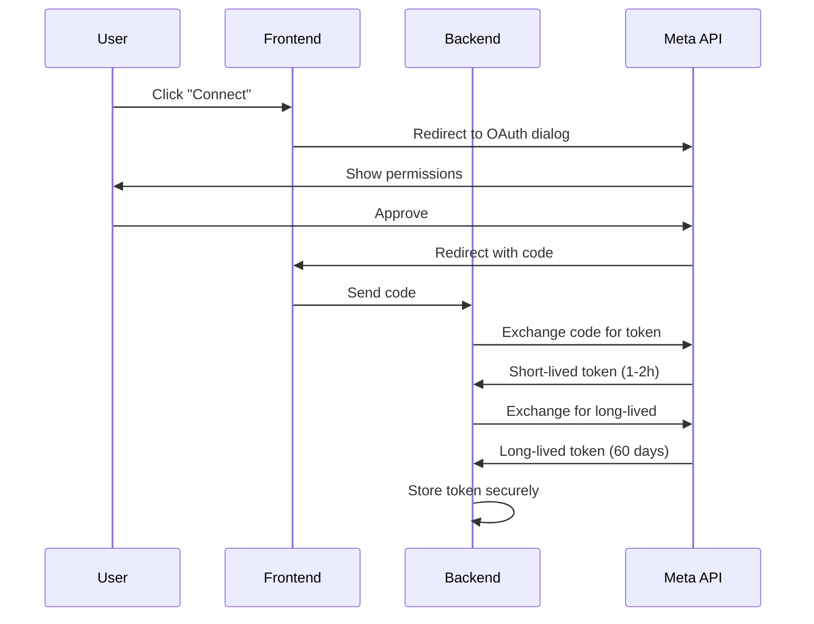

# OAuth 2.0 Flows for Meta APIs

> Reference for implementing OAuth authentication with Facebook Login across Meta products.

---

## Token Flow Overview



---

## Step 1: Generate Authorization URL

```typescript
const GRAPH_API_VERSION = 'v24.0';

function getAuthUrl(redirectUri: string, scopes: string[], state: string): string {
  const params = new URLSearchParams({
    client_id: process.env.FACEBOOK_APP_ID!,
    redirect_uri: redirectUri,
    scope: scopes.join(','),
    response_type: 'code',
    state: state, // CSRF protection
  });

  return `https://www.facebook.com/${GRAPH_API_VERSION}/dialog/oauth?${params.toString()}`;
}

// Example usage:
const authUrl = getAuthUrl(
  'https://yourdomain.com/api/meta/callback',
  ['whatsapp_business_management', 'whatsapp_business_messaging'],
  'mentorado_123'
);
```

---

## Step 2: Exchange Code for Short-Lived Token

```typescript
interface TokenResponse {
  access_token: string;
  token_type: 'bearer';
  expires_in?: number; // seconds
}

async function exchangeCodeForToken(code: string, redirectUri: string): Promise<TokenResponse> {
  const params = new URLSearchParams({
    client_id: process.env.FACEBOOK_APP_ID!,
    client_secret: process.env.FACEBOOK_APP_SECRET!,
    redirect_uri: redirectUri,
    code: code,
  });

  const response = await fetch(
    `https://graph.facebook.com/${GRAPH_API_VERSION}/oauth/access_token?${params.toString()}`
  );

  if (!response.ok) {
    const error = await response.json();
    throw new Error(`OAuth error: ${error.error?.message || 'Unknown error'}`);
  }

  return response.json();
}
```

---

## Step 3: Exchange for Long-Lived Token

```typescript
interface LongLivedTokenResponse {
  access_token: string;
  token_type: 'bearer';
  expires_in: number; // ~5184000 (60 days) for user tokens
}

async function exchangeForLongLivedToken(shortLivedToken: string): Promise<LongLivedTokenResponse> {
  const params = new URLSearchParams({
    grant_type: 'fb_exchange_token',
    client_id: process.env.FACEBOOK_APP_ID!,
    client_secret: process.env.FACEBOOK_APP_SECRET!,
    fb_exchange_token: shortLivedToken,
  });

  const response = await fetch(
    `https://graph.facebook.com/${GRAPH_API_VERSION}/oauth/access_token?${params.toString()}`
  );

  if (!response.ok) {
    const error = await response.json();
    throw new Error(`Token exchange failed: ${error.error?.message}`);
  }

  return response.json();
}
```

---

## Step 4: Refresh Token Before Expiry

> ⚠️ Long-lived tokens cannot be "refreshed" directly. You must re-exchange using the same endpoint.

```typescript
async function refreshLongLivedToken(currentToken: string): Promise<LongLivedTokenResponse> {
  // Same as exchangeForLongLivedToken
  const params = new URLSearchParams({
    grant_type: 'fb_exchange_token',
    client_id: process.env.FACEBOOK_APP_ID!,
    client_secret: process.env.FACEBOOK_APP_SECRET!,
    fb_exchange_token: currentToken,
  });

  const response = await fetch(
    `https://graph.facebook.com/${GRAPH_API_VERSION}/oauth/access_token?${params.toString()}`
  );

  return response.json();
}

// Schedule refresh 7 days before expiry
function shouldRefreshToken(expiresAt: Date): boolean {
  const sevenDaysFromNow = new Date();
  sevenDaysFromNow.setDate(sevenDaysFromNow.getDate() + 7);
  return expiresAt < sevenDaysFromNow;
}
```

---

## Scope Requirements by Product

| Product | Required Scopes | Description |
|---------|-----------------|-------------|
| **WhatsApp Business** | `whatsapp_business_management` | Manage WABA, phone numbers |
| | `whatsapp_business_messaging` | Send/receive messages |
| **Instagram** | `instagram_basic` | Read profile, media |
| | `pages_show_list` | List Facebook Pages |
| | `instagram_content_publish` | Publish posts, stories, reels |
| | `instagram_manage_comments` | Read/reply to comments |
| **Facebook Ads** | `ads_read` | Read ad insights |
| | `business_management` | Access Business Manager |
| | `ads_management` | Create/modify ads |
| | `read_insights` | Access page insights |

---

## Token Types Comparison

| Type | Validity | Use Case | How to Get |
|------|----------|----------|------------|
| **Short-lived User** | 1-2 hours | Immediate use after login | OAuth code exchange |
| **Long-lived User** | 60 days | Server-side API calls | Exchange short-lived |
| **Page Token** | Non-expiring* | Page operations | From long-lived user token |
| **System User Token** | Non-expiring | Business integrations | Business Manager |
| **App Token** | Non-expiring | Public data only | `APP_ID|APP_SECRET` |

*Non-expiring as long as the user token used to generate it is valid.

---

## Complete OAuth Callback Handler

```typescript
// server/routes/meta-oauth-callback.ts
import { Router } from 'express';

const router = Router();

router.get('/api/meta/callback', async (req, res) => {
  const { code, state, error, error_description } = req.query;

  // Handle user cancellation
  if (error) {
    console.error('OAuth error:', error_description);
    return res.redirect(`/settings?error=${encodeURIComponent(error_description as string)}`);
  }

  try {
    // 1. Exchange code for short-lived token
    const shortLivedToken = await exchangeCodeForToken(
      code as string,
      process.env.META_REDIRECT_URI!
    );

    // 2. Exchange for long-lived token
    const longLivedToken = await exchangeForLongLivedToken(shortLivedToken.access_token);

    // 3. Store token in database
    const expiresAt = new Date();
    expiresAt.setSeconds(expiresAt.getSeconds() + longLivedToken.expires_in);

    await db.update(mentorados).set({
      metaAccessToken: longLivedToken.access_token,
      metaTokenExpiresAt: expiresAt,
      metaConnected: 'sim',
      updatedAt: new Date(),
    }).where(eq(mentorados.id, parseInt(state as string)));

    // 4. Redirect to success page
    res.redirect('/settings?success=true');
  } catch (error) {
    console.error('OAuth callback error:', error);
    res.redirect('/settings?error=token_exchange_failed');
  }
});

export default router;
```

---

## Security Checklist

- [ ] Store `APP_SECRET` only in environment variables
- [ ] Use `state` parameter for CSRF protection
- [ ] Validate `state` matches expected value before processing
- [ ] Exchange tokens server-side only (never in frontend)
- [ ] Store tokens encrypted or in secure storage
- [ ] Implement token refresh before expiry
- [ ] Handle token revocation gracefully
