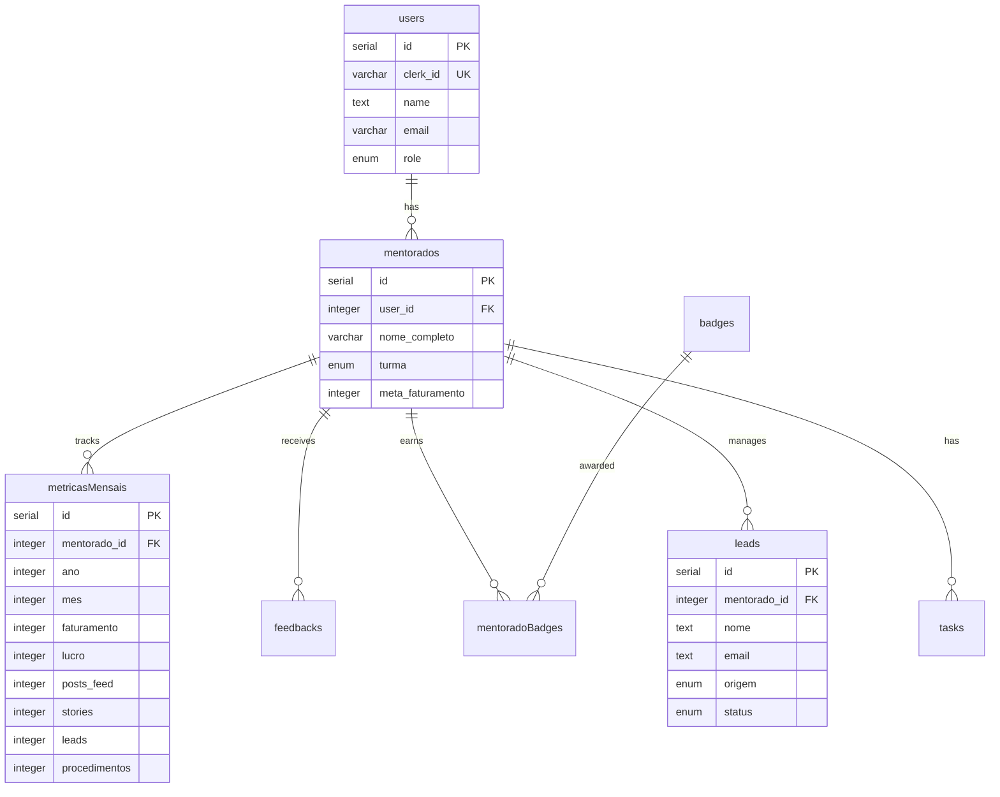

# 🚀 NEON Dashboard

<div align="center">


**Dashboard de Performance para Mentorias** — Plataforma fullstack para acompanhamento de métricas, gamificação e CRM de mentorados.

[Demo](https://neondash.grupousclinicas.com.br) · [Documentação](#-documentação) · [Contribuir](#-contribuindo)

</div>

---

## 📋 Sobre

O **NEON Dashboard** é uma plataforma completa de gestão de mentorias focada no nicho de estética e saúde. Permite que mentores acompanhem o desempenho de seus mentorados através de métricas mensais, gamificação com badges, CRM integrado e análises de IA.

### ✨ Principais Funcionalidades

| Módulo | Descrição |
|--------|-----------|
| **📊 Dashboard** | Visão geral de faturamento, lucro, leads e procedimentos |
| **📈 Métricas Mensais** | Registro e acompanhamento de KPIs mensais |
| **🎮 Gamificação** | Sistema de badges, rankings e streaks |
| **📱 CRM Kanban** | Gestão de leads com pipeline visual |
| **🤖 Neon Coach** | Assistente IA para geração de tarefas e insights |
| **🗺️ Jornada Neon** | Roadmap de atividades e módulos da mentoria |
| **📅 Calendário** | Integração com Google Calendar |
| **💬 WhatsApp** | Integração Z-API para comunicação |
| **📸 Instagram** | Sync automático de métricas (posts/stories) |

### 🎯 Phase 1 - Mentor Call Preparation

O sistema de preparação para calls oferece ferramentas completas para mentores:

| Feature | Descrição |
|---------|-----------|
| **📊 Alert Service** | Cálculos estatísticos com Z-score e fallback para identificar métricas críticas |
| **📞 Call Preparation** | Tela completa com 8 seções: header, alertas, métricas, gráficos, radar comparativo, notas anteriores, sugestões de tópicos e formulário |
| **📅 Upcoming Calls** | Visualização de próximas calls com integração Google Calendar e alertas por mentorado |
| **🤖 AI Topic Suggestions** | Sugestões inteligentes de tópicos baseadas em alertas e métricas |
| **📝 Call Notes** | Registro de insights, ações acordadas e próximos passos por call |


---

## 🛠️ Tech Stack

### Core
| Tecnologia | Versão | Uso |
|------------|--------|-----|
| **Bun** | 1.3+ | Runtime, package manager, bundler |
| **React** | 19.2 | Frontend SPA |
| **Vite** | 7.x | Build tool & HMR |
| **TypeScript** | 5.9 | Type safety |

### Backend
| Tecnologia | Uso |
|------------|-----|
| **Express** | HTTP server |
| **tRPC** | Type-safe API |
| **Drizzle ORM** | Database queries |
| **Neon PostgreSQL** | Serverless database |
| **Clerk** | Autenticação JWT |

### Frontend
| Tecnologia | Uso |
|------------|-----|
| **Tailwind CSS 4** | Styling |
| **shadcn/ui** | Component library |
| **TanStack Query** | Server state |
| **wouter** | Client-side routing |
| **Recharts** | Data visualization |
| **Framer Motion** | Animations |

### Integrações
| Serviço | Uso |
|---------|-----|
| **Clerk** | Auth & User management |
| **Google APIs** | Calendar integration |
| **Z-API** | WhatsApp Business |
| **Instagram Graph API** | Métricas sociais |
| **Gemini AI** | Coach inteligente |

---

## 📁 Estrutura do Projeto

```
neondash/
├── client/               # React SPA
│   └── src/
│       ├── components/   # UI + feature components
│       │   ├── ui/       # shadcn/ui primitives
│       │   ├── auth/     # Clerk auth components
│       │   └── dashboard/ # Dashboard widgets
│       ├── pages/        # Route pages
│       ├── hooks/        # Custom React hooks
│       ├── contexts/     # React contexts
│       └── lib/          # Utilities (tRPC client)
├── server/               # Express + tRPC backend
│   ├── _core/            # Core (index, context, vite, clerk)
│   └── routers/          # tRPC routers
├── shared/               # Shared types/constants
├── drizzle/              # Database schema + migrations
│   └── schema.ts         # PostgreSQL table definitions
├── docs/                 # Documentation
└── .agent/               # AI agent configuration
```

---

## 🗄️ Database Schema



---

## ⚡ Quick Start

### Pré-requisitos

- **Bun** 1.3+ ([instalar](https://bun.sh))
- Conta no **Neon** para PostgreSQL
- Conta no **Clerk** para autenticação

### 1. Clone o repositório

```bash
git clone https://github.com/GrupoUS/neondash.git
cd neondash
```

### 2. Instale as dependências

```bash
bun install
```

### 3. Configure as variáveis de ambiente

```bash
cp .env.example .env
```

Edite o `.env` com suas credenciais:

```env
# Database (Neon PostgreSQL)
DATABASE_URL="postgresql://..."

# Clerk Auth
VITE_CLERK_PUBLISHABLE_KEY="pk_..."
CLERK_SECRET_KEY="sk_..."

# JWT
JWT_SECRET="your-secret-key"

# Optional: AI
GEMINI_API_KEY="..."
```

### 4. Configure o banco de dados

```bash
bun run db:push
bun run db:seed
```

### 5. Inicie o servidor de desenvolvimento

```bash
bun dev
```

Acesse: **http://localhost:3000**

---

## 📜 Scripts Disponíveis

| Comando | Descrição |
|---------|-----------|
| `bun dev` | Inicia servidor de desenvolvimento com HMR |
| `bun run build` | Build de produção (Vite + Bun) |
| `bun start` | Executa build de produção |
| `bun run check` | Verifica tipos TypeScript |
| `bun run lint` | Lint + format com Biome (auto-fix) |
| `bun run lint:check` | Verifica lint sem auto-fix |
| `bun run test` | Executa testes com Vitest |
| `bun run test:watch` | Testes em modo watch |
| `bun run db:push` | Aplica migrations no banco |
| `bun run db:studio` | Abre Drizzle Studio |
| `bun run db:seed` | Popula banco com dados iniciais |

---

## 🔐 Autenticação

O projeto utiliza **Clerk** para autenticação. O fluxo inclui:

1. **Frontend**: `@clerk/clerk-react` com `ClerkProvider`
2. **Backend**: `@clerk/express` com middleware de autenticação
3. **tRPC**: Context com `ctx.user` para procedimentos protegidos

```tsx
// Frontend - Componentes de auth
import { SignInButton, UserButton } from "@clerk/clerk-react";

// Backend - tRPC protegido
const protectedProcedure = t.procedure.use(authMiddleware);
```

---

## 🧪 Qualidade de Código

### Linting & Formatting

O projeto usa **Biome** para linting e formatting:

```bash
# Verificar
bun run lint:check

# Corrigir automaticamente
bun run lint
```

### TypeScript

Strict mode habilitado. Verifique tipos com:

```bash
bun run check
```

### Testes

Vitest para unit tests:

```bash
bun run test
bun run test:watch
bun run test:coverage
```

---

## 🚀 Deploy

### Produção

```bash
# Build
bun run build

# Start
bun start
```

### Variáveis de Ambiente para Produção

```env
NODE_ENV=production
DATABASE_URL="postgresql://..."
VITE_CLERK_PUBLISHABLE_KEY="pk_live_..."
CLERK_SECRET_KEY="sk_live_..."
JWT_SECRET="production-secret"
```

---

## 📖 Documentação

| Documento | Descrição |
|-----------|-----------|
| [GEMINI.md](./GEMINI.md) | Guia completo para AI agents |
| [AGENTS.md](./AGENTS.md) | Regras de código e arquitetura |
| [docs/](./docs/) | Documentação adicional |

---

## 🤝 Contribuindo

1. Fork o repositório
2. Crie sua branch (`git checkout -b feature/amazing-feature`)
3. Commit suas mudanças (`git commit -m 'feat: add amazing feature'`)
4. Push para a branch (`git push origin feature/amazing-feature`)
5. Abra um Pull Request

### Convenção de Commits

Seguimos [Conventional Commits](https://www.conventionalcommits.org/):

- `feat:` Nova funcionalidade
- `fix:` Correção de bug
- `docs:` Documentação
- `style:` Formatação
- `refactor:` Refatoração
- `test:` Testes
- `chore:` Manutenção

---

## 📄 Licença

Este projeto está sob a licença MIT. Veja o arquivo [LICENSE](./LICENSE) para mais detalhes.

---

## 👥 Time

Desenvolvido por **Grupo US Clínicas** para o programa **Mentoria Black**.

---

<div align="center">

**[⬆ Voltar ao topo](#-neon-dashboard)**

</div>
