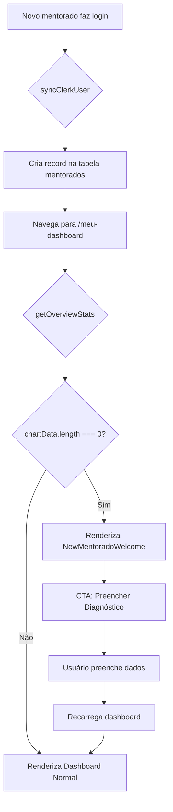

# PLAN-new-mentorado-dashboard: Fix Dashboard Loading para Novos Mentorados

> **Goal:** Resolver o problema de carregamento infinito no dashboard quando um novo mentorado faz login pela primeira vez.

## 0. Research Findings

| # | Finding | Confidence | Source | Impact |
|---|---------|------------|--------|--------|
| 1 | `syncClerkUser` já cria mentorado automaticamente no primeiro login | 5/5 | `server/services/userService.ts:76-84` | Mentorado existe, mas sem dados |
| 2 | `getOverviewStats` retorna `chartData: []` quando não há métricas | 5/5 | `server/mentoradosRouter.ts:475-480` | Dados tecnicamente válidos mas vazios |
| 3 | `MenteeOverview` mostra skeleton quando `!stats` mas nunca trata `stats.financials.chartData.length === 0` | 5/5 | `client/src/components/dashboard/MenteeOverview.tsx:39-41` | **ROOT CAUSE** |
| 4 | RoadmapView já trata progresso 0% corretamente | 4/5 | `server/routers/playbook.ts:175-204` | Componente funciona para novos usuários |
| 5 | FinancialHistoryChart não trata array vazio | 4/5 | `client/src/components/dashboard/FinancialHistoryChart.tsx:37-43` | Gráfico renderiza sem dados |
| 6 | NextLiveCard e AITasksCard funcionam independentemente das métricas | 4/5 | Código fonte | Não afetados |

### Knowledge Gaps & Assumptions

- **Gap:** Não foi possível verificar exatamente quando o skeleton desaparece vs. quando deveria mostrar empty state
- **Assumption:** O problema é puramente de UI (não há loops infinitos no backend)
- **Assumption:** Usuário prefere ver mensagem "Bem-vindo" em vez de dashboard vazio

### Edge Cases

1. Mentorado com diagnóstico preenchido mas sem métricas mensais
2. Mentorado com apenas 1 mês de dados (histórico limitado)
3. Admin visualizando dashboard de mentorado novo
4. Mentorado que preencheu métricas mas ainda não tem progresso no roadmap
5. Reconexão/reload durante primeiro preenchimento de dados

---

## 1. User Review Required

> [!IMPORTANT]
> **Decisão de Design UX**
> A solução proposta é tratar o "empty state" na UI ao invés de criar dados falsos no banco.
> Isso significa que novos mentorados verão uma tela de boas-vindas com instruções claras.

**Alternativa rejeitada:** Auto-criar métricas com valor 0 - poluiria o banco com dados sem significado.

---

## 2. Proposed Changes

### Frontend Components

---

#### [NEW] [NewMentoradoWelcome.tsx](file:///home/mauricio/neondash/client/src/components/dashboard/NewMentoradoWelcome.tsx)

Novo componente de boas-vindas para mentorados sem dados:
- UI atraente com ilustração/ícone de boas-vindas
- Explicação dos primeiros passos
- CTA para navegação direta ao tab "Diagnóstico"
- Opção secundária para preencher "Métricas do Mês"

---

#### [MODIFY] [MenteeOverview.tsx](file:///home/mauricio/neondash/client/src/components/dashboard/MenteeOverview.tsx)

**Ação:** Adicionar verificação de empty state antes de renderizar dashboard

```diff
+ import { NewMentoradoWelcome } from "./NewMentoradoWelcome";

  if (isLoading || !stats) {
    return <OverviewSkeleton />;
  }

+ // Check if this is a new mentorado without data
+ const hasNoData = stats.financials.chartData.length === 0;
+ if (hasNoData && !isAdmin) {
+   return <NewMentoradoWelcome mentoradoName={mentorado.nomeCompleto} />;
+ }
```

---

#### [MODIFY] [FinancialHistoryChart.tsx](file:///home/mauricio/neondash/client/src/components/dashboard/FinancialHistoryChart.tsx)

**Ação:** Tratar array vazio com mensagem amigável

```diff
+ if (data.length === 0) {
+   return (
+     <Card className="...">
+       <CardContent className="h-[300px] flex items-center justify-center">
+         <p className="text-muted-foreground">Nenhum dado financeiro registrado ainda.</p>
+       </CardContent>
+     </Card>
+   );
+ }
```

---

## 3. Atomic Implementation Tasks

> [!CAUTION]
> Cada tarefa DEVE ter subtarefas. Nenhuma tarefa de linha única permitida.

### AT-001: Criar componente NewMentoradoWelcome
**Goal:** Componente de boas-vindas para novos mentorados
**Dependencies:** None

#### Subtasks:
- [ ] ST-001.1: Criar arquivo `client/src/components/dashboard/NewMentoradoWelcome.tsx`
  - **File:** `client/src/components/dashboard/NewMentoradoWelcome.tsx`
  - **Validation:** `bun run check` passa
- [ ] ST-001.2: Implementar UI com Card, ícone de boas-vindas e CTAs
  - **File:** `client/src/components/dashboard/NewMentoradoWelcome.tsx`
  - **Validation:** Componente renderiza sem erros
- [ ] ST-001.3: Adicionar props para nome do mentorado e callback de navegação
  - **File:** `client/src/components/dashboard/NewMentoradoWelcome.tsx`
  - **Validation:** Tipos TypeScript corretos

**Rollback:** Deletar arquivo `NewMentoradoWelcome.tsx`

---

### AT-002: Integrar empty state no MenteeOverview ⚡
**Goal:** Detectar quando mentorado não tem dados e mostrar boas-vindas
**Dependencies:** AT-001

#### Subtasks:
- [ ] ST-002.1: Importar `NewMentoradoWelcome` no `MenteeOverview`
  - **File:** `client/src/components/dashboard/MenteeOverview.tsx`
  - **Validation:** Import sem erros
- [ ] ST-002.2: Adicionar verificação de `chartData.length === 0`
  - **File:** `client/src/components/dashboard/MenteeOverview.tsx`
  - **Validation:** Condição correta
- [ ] ST-002.3: Renderizar `NewMentoradoWelcome` quando sem dados
  - **File:** `client/src/components/dashboard/MenteeOverview.tsx`
  - **Validation:** Novo mentorado vê tela de boas-vindas

**Rollback:** `git checkout client/src/components/dashboard/MenteeOverview.tsx`

---

### AT-003: Tratar empty state no FinancialHistoryChart ⚡
**Goal:** Mostrar mensagem amigável quando não há dados
**Dependencies:** None

#### Subtasks:
- [ ] ST-003.1: Adicionar verificação de `data.length === 0`
  - **File:** `client/src/components/dashboard/FinancialHistoryChart.tsx`
  - **Validation:** Condição antes do return principal
- [ ] ST-003.2: Renderizar Card com mensagem quando sem dados
  - **File:** `client/src/components/dashboard/FinancialHistoryChart.tsx`
  - **Validation:** Gráfico não quebra com array vazio

**Rollback:** `git checkout client/src/components/dashboard/FinancialHistoryChart.tsx`

---

### AT-004: Verificação E2E
**Goal:** Validar fluxo completo de novo mentorado
**Dependencies:** AT-001, AT-002, AT-003

#### Subtasks:
- [ ] ST-004.1: Executar `bun run check` para validar tipos
  - **Validation:** Zero erros TypeScript
- [ ] ST-004.2: Executar `bun run lint` para validar formatação
  - **Validation:** Zero warnings
- [ ] ST-004.3: Testar manualmente: criar novo usuário e verificar dashboard
  - **Validation:** Tela de boas-vindas aparece
- [ ] ST-004.4: Testar manualmente: preencher uma métrica e verificar dashboard normal
  - **Validation:** Dashboard normal renderiza após dados

**Rollback:** N/A (apenas verificação)

---

## 4. Verification Plan

### Automated Tests

```bash
bun run check   # TypeScript validation
bun run lint    # Biome lint + format
bun test        # Vitest (se houver testes relevantes)
```

### Manual Verification

1. **Criar novo usuário no Clerk**
   - Fazer login com email que não existe na base
   - Verificar que mentorado é criado automaticamente

2. **Verificar Dashboard Vazio**
   - Navegar para `/meu-dashboard`
   - ✅ Deve mostrar tela de boas-vindas com CTAs
   - ❌ Não deve mostrar skeleton infinito

3. **Preencher Primeira Métrica**
   - Ir para aba "Diagnóstico" ou preencher métrica do mês
   - Voltar para "Visão Geral"
   - ✅ Dashboard deve renderizar normalmente

4. **Testar como Admin**
   - Como admin, selecionar mentorado novo
   - ✅ Deve mostrar dados vazios (não boas-vindas) para admin

---

## 5. Rollback Plan

```bash
# Se precisar reverter todas as mudanças:
git checkout client/src/components/dashboard/MenteeOverview.tsx
git checkout client/src/components/dashboard/FinancialHistoryChart.tsx
rm client/src/components/dashboard/NewMentoradoWelcome.tsx

# Rebuild
bun run check
```

---

## 6. Diagrama de Fluxo


