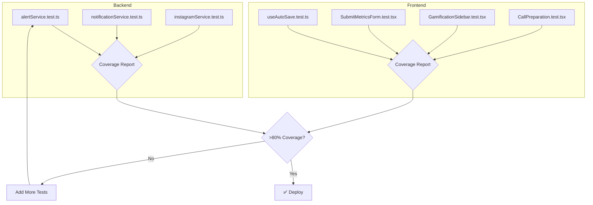

# PLAN-phase1-testing: Phase 1 Testing & Quality Assurance

> **Goal:** Achieve >80% test coverage on critical services with comprehensive backend and frontend tests, UX improvements, and documentation updates.

---

## 0. Research Findings

| # | Finding | Confidence | Source | Impact |
|---|---------|------------|--------|--------|
| 1 | Existing tests use `vi.mock()` pattern with procedure definition verification | 5/5 | `gamificacao.test.ts`, `instagram.test.ts` | Must follow same pattern |
| 2 | Vitest config currently only includes `server/**/*.test.ts` | 5/5 | `vitest.config.ts` | Need to add frontend test patterns |
| 3 | No frontend tests exist yet | 5/5 | `client/src/` exploration | Need test setup for React Testing Library |
| 4 | Services have extensive JSDoc (alertService, notificationService) | 5/5 | Service file outlines | Unit test targets clearly documented |
| 5 | 11 services, 9 routers, 13 hooks, 18 pages identified | 5/5 | Directory listing | Scope for test coverage |
| 6 | `useAutoSave` and `useInstagramMetrics` hooks are well-documented | 5/5 | Hook files | Clear test cases from JSDoc |
| 7 | Test command is `bun test` (Vitest) | 5/5 | `package.json`, GEMINI.md | Verified test runner |

### Knowledge Gaps
- **Gap:** No E2E testing infrastructure exists (Playwright not configured)
- **Gap:** Coverage thresholds not currently enforced in CI

### Assumptions to Validate
- **Assumption:** React Testing Library can be installed without conflicts
- **Assumption:** tRPC hooks can be mocked with vitest

### Edge Cases (Backend)
1. alertService: Division by zero in Z-score calculation
2. alertService: Empty turma metrics (fallback to previous month)
3. notificationService: Email failure with in-app success
4. notificationService: Spam control with edge date boundaries
5. instagramService: Token expiration during sync

### Edge Cases (Frontend)
1. useAutoSave: Empty field blur (should not save)
2. useAutoSave: Value unchanged from server (skip mutation)
3. SubmitMetricsForm: Instagram sync data populating fields
4. GamificationSidebar: First badge unlock (confetti trigger)
5. CallPreparation: AI suggestions fallback on API failure

---

## 1. User Review Required

> [!IMPORTANT]
> **Testing Scope Decision Required**
> 
> The plan includes comprehensive backend and frontend tests. E2E testing with Playwright is marked as **optional** due to infrastructure setup complexity. Please confirm:
> 1. Should E2E tests be included in Phase 1 or deferred?
> 2. Is >80% coverage on `alertService`, `notificationService`, `instagramService` acceptable as the primary target?

---

## 2. Proposed Changes

### Phase 1: Backend Service Tests ⚡

---

#### [NEW] [alertService.test.ts](file:///home/mauricio/neondash/server/services/alertService.test.ts)
- **Action:** Create comprehensive unit tests for Alert Service
- **Details:**
  - Test statistical functions: `calculateMean`, `calculateStandardDeviation`, `calculateZScore`, `calculatePercentChange`
  - Test alert classification: `classifyAlert` with various thresholds
  - Test `calculateAlerts` with mocked database
  - Test `generateTopicSuggestions` with AI mock and fallback
  - Mock: `getDb`, `generateText` (AI)
- **Coverage Target:** >80%

---

#### [NEW] [notificationService.test.ts](file:///home/mauricio/neondash/server/services/notificationService.test.ts)
- **Action:** Create unit tests for Notification Service
- **Details:**
  - Test `sendDualNotification` with email success/failure scenarios
  - Test specialized: `sendMetricsReminder`, `sendBadgeUnlocked`, `sendInstagramReconnectNeeded`
  - Test spam control: `shouldSendReminder` with various conditions
  - Mock: `getDb`, `sendEmail`
- **Coverage Target:** >80%

---

#### [NEW] [instagramService.test.ts](file:///home/mauricio/neondash/server/services/instagramService.test.ts)
- **Action:** Create unit tests for Instagram Service (service layer, not router)
- **Details:**
  - Test OAuth flow: `getAuthUrl`, `exchangeCodeForTokens`, `exchangeForLongLivedToken`
  - Test API calls: `getMediaInsights`, `getStoriesInsights` with mocked fetch
  - Test sync: `syncMentoradoMetrics`, `syncAllMentorados`
  - Test utilities: `isTokenExpired`, `getMonthDateRange`, `fetchWithRetry`
  - Mock: `getDb`, global `fetch`
- **Coverage Target:** >80%

---

### Phase 2: Backend Router Tests ⚡

---

#### [MODIFY] [gamificacao.test.ts](file:///home/mauricio/neondash/server/gamificacao.test.ts)
- **Action:** Expand with new procedure tests
- **Details:**
  - Add tests for `checkNewBadges` with badge criteria evaluation
  - Add tests for `myBadges`, `mentoradoBadges` data structure
  - Verify notification service integration for badge unlocks

---

#### [NEW] [mentor.test.ts](file:///home/mauricio/neondash/server/routers/mentor.test.ts)
- **Action:** Create integration tests for Mentor Router
- **Details:**
  - Test `getUpcomingCalls` procedure definition and type
  - Test `getCallPreparation` aggregation logic
  - Test `saveCallNotes` mutation
  - Test `generateTopicSuggestions` procedure
  - Mock: `alertService`, `googleCalendarService`, `getDb`

---

### Phase 3: Frontend Test Infrastructure

---

#### [MODIFY] [vitest.config.ts](file:///home/mauricio/neondash/vitest.config.ts)
- **Action:** Add frontend test patterns and coverage configuration
- **Details:**
  ```typescript
  test: {
    environment: "node",
    include: [
      "server/**/*.test.ts",
      "server/**/*.spec.ts",
      "client/**/*.test.ts",
      "client/**/*.test.tsx"
    ],
    coverage: {
      provider: 'v8',
      reporter: ['text', 'json', 'html'],
      thresholds: {
        lines: 80,
        functions: 80,
      }
    }
  }
  ```

---

#### [NEW] [setup.ts](file:///home/mauricio/neondash/client/src/test/setup.ts)
- **Action:** Create test setup file for React Testing Library
- **Details:**
  - Mock tRPC client
  - Setup Testing Library cleanup
  - Mock `window.matchMedia` for responsive tests
  - Configure global test utilities

---

### Phase 4: Frontend Hook Tests

---

#### [NEW] [useAutoSave.test.ts](file:///home/mauricio/neondash/client/src/hooks/useAutoSave.test.ts)
- **Action:** Create unit tests for useAutoSave hook
- **Details:**
  - Test blur handler triggers mutation with correct params
  - Test bail-out conditions: empty field, unchanged value, not hydrated
  - Test loading/saved states
  - Test error handling with toast
  - Mock: `trpc.mentorados.updateMetricaField.useMutation`

---

#### [NEW] [useInstagramMetrics.test.ts](file:///home/mauricio/neondash/client/src/hooks/useInstagramMetrics.test.ts)
- **Action:** Create unit tests for useInstagramMetrics hook
- **Details:**
  - Test query execution with correct params
  - Test 24h stale time configuration
  - Test enabled flag disables query
  - Mock: `trpc.mentorados.getInstagramMetrics.useQuery`

---

### Phase 5: Frontend Component Tests

---

#### [NEW] [SubmitMetricsForm.test.tsx](file:///home/mauricio/neondash/client/src/components/dashboard/SubmitMetricsForm.test.tsx)
- **Action:** Create component tests
- **Details:**
  - Test rendering: form fields, period selectors, Instagram button
  - Test auto-save blur events
  - Test form submission and validation
  - Test form reset after success
  - Mock: tRPC hooks, useAutoSave, useInstagramMetrics

---

#### [NEW] [GamificationSidebar.test.tsx](file:///home/mauricio/neondash/client/src/components/dashboard/GamificationSidebar.test.tsx)
- **Action:** Create component tests
- **Details:**
  - Test rendering: streak counter, badges, progress
  - Test loading skeletons
  - Test confetti on new badge
  - Mock: tRPC gamificacao hooks

---

#### [NEW] [CallPreparation.test.tsx](file:///home/mauricio/neondash/client/src/pages/CallPreparation.test.tsx)
- **Action:** Create page tests
- **Details:**
  - Test rendering all sections (alerts, metrics, charts, notes)
  - Test loading, error, and empty states
  - Test notes form save mutation
  - Mock: tRPC mentor hooks

---

#### [NEW] [UpcomingCalls.test.tsx](file:///home/mauricio/neondash/client/src/pages/UpcomingCalls.test.tsx)
- **Action:** Create page tests
- **Details:**
  - Test calendar view, call cards, status indicators
  - Test filter functionality
  - Test navigation to call preparation
  - Test empty state
  - Mock: tRPC mentor hooks

---

### Phase 6: UX Improvements

---

#### [MODIFY] [SubmitMetricsForm.tsx](file:///home/mauricio/neondash/client/src/components/dashboard/SubmitMetricsForm.tsx)
- **Action:** Add post-submit redirect
- **Details:**
  - Import `useLocation` from wouter
  - Navigate to `/dashboard?tab=evolucao` on success
  - Show success toast with redirect message

---

#### [NEW] [ErrorBoundary.tsx](file:///home/mauricio/neondash/client/src/components/ErrorBoundary.tsx)
- **Action:** Create reusable error boundary component
- **Details:**
  - Wrap critical pages (CallPreparation, UpcomingCalls)
  - Display user-friendly error message
  - Provide retry action

---

### Phase 7: Documentation

---

#### [MODIFY] [README.md](file:///home/mauricio/neondash/README.md)
- **Action:** Add Phase 1 features and testing section
- **Details:**
  - Add "Fase 1: Funcionalidades Implementadas" section
  - Update testing section with coverage targets
  - Add Instagram integration setup instructions

---

## 3. Atomic Implementation Tasks

> [!CAUTION]
> Each task MUST have subtasks. Execute in order respecting dependencies.

### AT-001: Backend Service Tests - Alert Service ⚡
**Goal:** Create comprehensive unit tests for alertService
**Dependencies:** None

#### Subtasks:
- [ ] ST-001.1: Create `server/services/alertService.test.ts` with vi.mock setup
  - **File:** `server/services/alertService.test.ts`
  - **Validation:** `bun test server/services/alertService.test.ts`
- [ ] ST-001.2: Test statistical functions (calculateMean, calculateStandardDeviation, calculateZScore, calculatePercentChange)
  - **Validation:** All statistical tests pass
- [ ] ST-001.3: Test classifyAlert with edge cases (division by zero, null values)
  - **Validation:** Edge case tests pass
- [ ] ST-001.4: Test calculateAlerts with mocked database scenarios
  - **Validation:** Integration-style tests pass
- [ ] ST-001.5: Test generateTopicSuggestions with AI mock and fallback
  - **Validation:** AI and fallback tests pass

**Rollback:** `git checkout server/services/alertService.test.ts`

---

### AT-002: Backend Service Tests - Notification Service ⚡
**Goal:** Create unit tests for notificationService
**Dependencies:** None (parallel-safe with AT-001)

#### Subtasks:
- [ ] ST-002.1: Create `server/services/notificationService.test.ts` with mocks
  - **File:** `server/services/notificationService.test.ts`
  - **Validation:** `bun test server/services/notificationService.test.ts`
- [ ] ST-002.2: Test sendDualNotification with success/failure scenarios
  - **Validation:** Dual-channel tests pass
- [ ] ST-002.3: Test specialized notifications (reminder, badge, Instagram)
  - **Validation:** All specialized tests pass
- [ ] ST-002.4: Test shouldSendReminder spam control logic
  - **Validation:** Spam control tests pass

**Rollback:** `git checkout server/services/notificationService.test.ts`

---

### AT-003: Backend Service Tests - Instagram Service ⚡
**Goal:** Create unit tests for instagramService
**Dependencies:** None (parallel-safe with AT-001, AT-002)

#### Subtasks:
- [ ] ST-003.1: Create `server/services/instagramService.test.ts` with fetch mock
  - **File:** `server/services/instagramService.test.ts`
  - **Validation:** `bun test server/services/instagramService.test.ts`
- [ ] ST-003.2: Test OAuth flow functions
  - **Validation:** OAuth tests pass
- [ ] ST-003.3: Test API call functions with mocked responses
  - **Validation:** API mock tests pass
- [ ] ST-003.4: Test sync logic with database mocks
  - **Validation:** Sync tests pass
- [ ] ST-003.5: Test utility functions (token expiry, date range, retry)
  - **Validation:** Utility tests pass

**Rollback:** `git checkout server/services/instagramService.test.ts`

---

### AT-004: Frontend Test Infrastructure
**Goal:** Set up frontend testing with React Testing Library
**Dependencies:** None

#### Subtasks:
- [ ] ST-004.1: Install `@testing-library/react` and `jsdom`
  - **Command:** `bun add -d @testing-library/react @testing-library/react-hooks jsdom`
  - **Validation:** `bun install` completes without errors
- [ ] ST-004.2: Update `vitest.config.ts` with frontend patterns
  - **File:** `vitest.config.ts`
  - **Validation:** Config loads without errors
- [ ] ST-004.3: Create `client/src/test/setup.ts` with mocks
  - **File:** `client/src/test/setup.ts`
  - **Validation:** Setup file imports without errors

**Rollback:** `git checkout vitest.config.ts && rm -rf client/src/test/`

---

### AT-005: Frontend Hook Tests
**Goal:** Create tests for critical hooks
**Dependencies:** AT-004

#### Subtasks:
- [ ] ST-005.1: Create `client/src/hooks/useAutoSave.test.ts`
  - **File:** `client/src/hooks/useAutoSave.test.ts`
  - **Validation:** `bun test client/src/hooks/useAutoSave.test.ts`
- [ ] ST-005.2: Create `client/src/hooks/useInstagramMetrics.test.ts`
  - **File:** `client/src/hooks/useInstagramMetrics.test.ts`
  - **Validation:** `bun test client/src/hooks/useInstagramMetrics.test.ts`

**Rollback:** `git checkout client/src/hooks/`

---

### AT-006: Frontend Component Tests
**Goal:** Create tests for critical components
**Dependencies:** AT-004, AT-005

#### Subtasks:
- [ ] ST-006.1: Create `SubmitMetricsForm.test.tsx`
  - **File:** `client/src/components/dashboard/SubmitMetricsForm.test.tsx`
  - **Validation:** `bun test client/src/components/dashboard/SubmitMetricsForm.test.tsx`
- [ ] ST-006.2: Create `GamificationSidebar.test.tsx`
  - **File:** `client/src/components/dashboard/GamificationSidebar.test.tsx`
  - **Validation:** `bun test client/src/components/dashboard/GamificationSidebar.test.tsx`
- [ ] ST-006.3: Create `CallPreparation.test.tsx`
  - **File:** `client/src/pages/CallPreparation.test.tsx`
  - **Validation:** `bun test client/src/pages/CallPreparation.test.tsx`
- [ ] ST-006.4: Create `UpcomingCalls.test.tsx`
  - **File:** `client/src/pages/UpcomingCalls.test.tsx`
  - **Validation:** `bun test client/src/pages/UpcomingCalls.test.tsx`

**Rollback:** `git checkout client/src/components/ && git checkout client/src/pages/`

---

### AT-007: UX Improvements
**Goal:** Implement post-submit redirect and error handling
**Dependencies:** AT-006 (tests first)

#### Subtasks:
- [ ] ST-007.1: Add post-submit redirect to SubmitMetricsForm
  - **File:** `client/src/components/dashboard/SubmitMetricsForm.tsx`
  - **Validation:** Submit form → redirects to `/dashboard?tab=evolucao`
- [ ] ST-007.2: Create ErrorBoundary component
  - **File:** `client/src/components/ErrorBoundary.tsx`
  - **Validation:** Component renders fallback on error
- [ ] ST-007.3: Wrap critical pages with ErrorBoundary
  - **Files:** `CallPreparation.tsx`, `UpcomingCalls.tsx`
  - **Validation:** Error UI shows on component error

**Rollback:** `git checkout client/src/components/`

---

### AT-008: Documentation Updates
**Goal:** Update README with Phase 1 features
**Dependencies:** AT-001 through AT-007

#### Subtasks:
- [ ] ST-008.1: Add Phase 1 features section to README
  - **File:** `README.md`
  - **Validation:** Markdown renders correctly
- [ ] ST-008.2: Update testing section with commands
  - **File:** `README.md`
  - **Validation:** Commands documented

**Rollback:** `git checkout README.md`

---

### AT-009: Final Validation
**Goal:** Verify all quality gates pass
**Dependencies:** AT-001 through AT-008

#### Subtasks:
- [ ] ST-009.1: Run TypeScript check
  - **Command:** `bun run check`
  - **Validation:** Exit code 0
- [ ] ST-009.2: Run linter
  - **Command:** `bun run lint`
  - **Validation:** Exit code 0
- [ ] ST-009.3: Run all tests
  - **Command:** `bun test`
  - **Validation:** All tests pass
- [ ] ST-009.4: Verify coverage targets
  - **Command:** `bun test --coverage`
  - **Validation:** >80% on alertService, notificationService, instagramService

**Rollback:** Fix failing tests or revert changes

---

## 4. Verification Plan

### Automated Tests

```bash
# Run all backend tests
bun test server/

# Run specific service tests
bun test server/services/alertService.test.ts
bun test server/services/notificationService.test.ts
bun test server/services/instagramService.test.ts

# Run frontend tests (after AT-004)
bun test client/

# Run with coverage
bun test --coverage

# TypeScript validation
bun run check

# Linting
bun run lint
```

### Manual Verification

1. **Post-Submit Redirect:**
   - Navigate to dashboard
   - Fill metrics form
   - Submit
   - Verify redirect to `?tab=evolucao`

2. **Error Boundary:**
   - Temporarily throw error in CallPreparation
   - Verify error UI displays
   - Verify retry button works

---

## 5. Rollback Plan

```bash
# Revert all changes
git checkout .

# Revert specific test files
git checkout server/services/*.test.ts
git checkout client/src/hooks/*.test.ts
git checkout client/src/components/**/*.test.tsx

# Remove new test infrastructure
rm -rf client/src/test/
git checkout vitest.config.ts
```

---

## 6. Visual Aid: Test Coverage Flow



---

## Pre-Submission Checklist

### Research
- [x] Codebase patterns searched and documented
- [x] Existing tests analyzed for patterns
- [x] Vitest configuration reviewed
- [x] Findings Table with 7+ entries

### Context
- [x] Knowledge Gaps listed
- [x] Assumptions listed
- [x] Edge cases documented (10 total)
- [x] File paths verified

### Tasks
- [x] All tasks have AT-XXX IDs
- [x] All tasks have subtasks (ST-XXX.N)
- [x] Each subtask has validation
- [x] Dependencies mapped
- [x] Rollback steps defined
- [x] Parallel-safe marked with ⚡

### Quality
- [x] Mode: CONSERVATIVE
- [x] Output: Plan file only
- [x] Success criteria measurable (>80% coverage)
