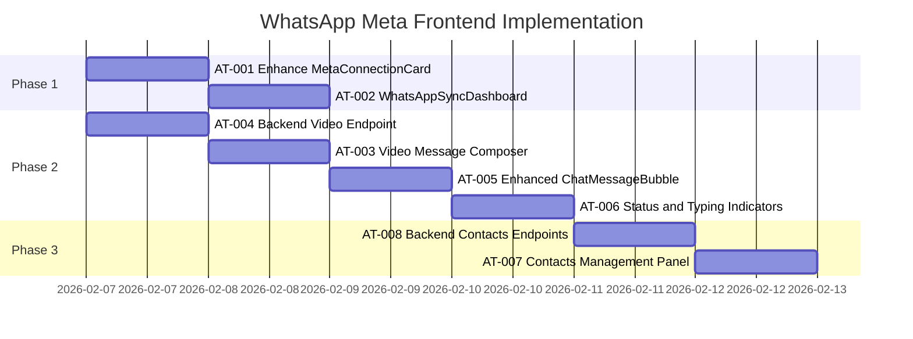

# PLAN-whatsapp-meta-sync-frontend: WhatsApp Meta Cloud API Frontend Integration

> **Goal:** Create a complete frontend interface for WhatsApp synchronization via Meta Cloud API, enabling mentorados to connect their WhatsApp Business account, sync conversations, and send text/video messages to contacts — all through our platform using the official Meta API.

---

## 0. Research Findings

| # | Finding | Confidence | Source | Impact |
|---|---------|------------|--------|--------|
| 1 | **Existing backend fully implemented**: `metaApiRouter.ts` (664 lines) with 10+ endpoints: getStatus, configure, exchangeCode, disconnect, sendMessage, sendTemplateMessage, getMessages, getAllConversations, linkContacts, getMessagesByPhone, markAsRead | 5/5 | Codebase | Critical - Frontend only needed, backend ready |
| 2 | **ChatPage.tsx already exists** (578 lines): Full inbox UI with conversation list, real-time messaging, contact management. Uses `metaApi.getAllConversations` and `metaApi.sendMessage` | 5/5 | Codebase | Major - Extend existing, don't rebuild |
| 3 | **MetaConnectionCard.tsx exists** (427 lines): Facebook Embedded Signup integration with SDK loading, code exchange flow. Needs minor enhancements | 5/5 | Codebase | Major - Polish existing component |
| 4 | **z-api.io reference model**: Key patterns include QR code scanning, instance connection status, chat list with pagination, send text/video with delay options, webhook-based real-time sync | 4/5 | Jina/z-api.io docs | Design guidance only |
| 5 | **Meta Cloud API video sending**: Requires media upload to Meta servers first via Graph API, then reference by media_id. Different from z-api's direct URL/base64 | 5/5 | Meta API docs | High - New feature needed |
| 6 | **Database schema ready**: `whatsappMessages` (direction, content, status, isFromAi), `whatsappContacts` (phone, name), mentorados with Meta fields (metaWabaId, metaPhoneNumberId, metaAccessToken) | 5/5 | Drizzle schema | Critical - No schema changes needed |
| 7 | **Webhook endpoint exists**: `server/webhooks/metaWebhook.ts` handles inbound messages and status updates | 5/5 | Codebase (SKILL.md) | Backend ready |
| 8 | **Meta requires 24-hour template window**: Free-form messages can only be sent within 24 hours of customer-initiated conversation. Otherwise, must use approved templates | 5/5 | Meta docs | UX design consideration |

### Knowledge Gaps & Assumptions

- **Gap:** No media (image/video) upload endpoint exists in backend
- **Assumption:** Video sending will use URL-based approach initially (simpler than full media upload flow)
- **Assumption:** Template message sending is already supported via `sendTemplateMessage` endpoint
- **Assumption:** Real-time updates via polling (WebSocket not implemented)

---

## 1. User Review Required

> [!IMPORTANT]
> **Meta API Limitations vs z-api.io Features:**
> - **z-api.io** uses WhatsApp Web mirroring (unofficial) - supports unlimited free-form messages
> - **Meta Cloud API** (official) requires template messages outside 24-hour window
> - UI will show clear guidance when template is required vs free-text allowed

> [!IMPORTANT]
> **Video Sending Approach:**
> - Phase 1: Support video via public URL only (simpler implementation)
> - Phase 2 (future): Full media upload via Meta Graph API for file upload

---

## 2. Proposed Changes

### Phase 1: Enhanced Connection Experience

#### [MODIFY] [MetaConnectionCard.tsx](file:///home/mauricio/neondash/client/src/components/whatsapp/MetaConnectionCard.tsx)
- **Action:** Add connection status polling, verified name display, quality rating badge
- **Details:** Show phone number, business verification status, add reconnect action for expired tokens

#### [NEW] [WhatsAppSyncDashboard.tsx](file:///home/mauricio/neondash/client/src/components/whatsapp/WhatsAppSyncDashboard.tsx)
- **Action:** Create unified dashboard combining connection card + sync statistics
- **Details:** Show messages synced count, last sync time, webhook status indicator

---

### Phase 2: Enhanced Chat Interface (Inspired by z-api.io)

#### [MODIFY] [ChatPage.tsx](file:///home/mauricio/neondash/client/src/pages/ChatPage.tsx)
- **Action:** Add video message composing, message status indicators, typing simulation
- **Details:**
  - Add video attachment button with URL input modal
  - Show message delivery status (sent → delivered → read)
  - Add "typing" indicator when composing
  - Add message search/filter

#### [MODIFY] [ChatMessageBubble.tsx](file:///home/mauricio/neondash/client/src/components/chat/ChatMessageBubble.tsx)
- **Action:** Support video message rendering, status icons, AI badge
- **Details:**
  - Render video content with inline player
  - Show ✓ (sent), ✓✓ (delivered), ✓✓ blue (read) status
  - Show AI badge for isFromAi="sim"

#### [NEW] [VideoMessageComposer.tsx](file:///home/mauricio/neondash/client/src/components/chat/VideoMessageComposer.tsx)
- **Action:** Dialog for composing video messages
- **Details:**
  - URL input field with validation
  - Preview thumbnail if possible
  - Caption field
  - Send button with loading state

---

### Phase 3: Backend Enhancements

#### [MODIFY] [metaApiRouter.ts](file:///home/mauricio/neondash/server/metaApiRouter.ts)
- **Action:** Add video message sending endpoint
- **Details:**
  - New `sendVideoMessage` mutation accepting URL + phone + caption
  - Validation for video URL format

#### [NEW] [metaApiService.ts](file:///home/mauricio/neondash/server/services/metaApiService.ts) - Enhance existing
- **Action:** Add `sendVideoMessage` method to existing service
- **Details:**
  - Use Meta Cloud API video message endpoint
  - Handle media_id vs URL approach

---

### Phase 4: Contacts Management (z-api.io inspired)

#### [NEW] [ContactsListPanel.tsx](file:///home/mauricio/neondash/client/src/components/chat/ContactsListPanel.tsx)
- **Action:** Dedicated contacts management panel
- **Details:**
  - List all WhatsApp contacts synced
  - Add/edit contact names
  - Link contacts to CRM leads
  - Search/filter contacts

#### [MODIFY] [metaApiRouter.ts](file:///home/mauricio/neondash/server/metaApiRouter.ts)
- **Action:** Add contacts management endpoints
- **Details:**
  - `getContacts` - List all contacts with pagination
  - `updateContact` - Update contact name/notes
  - `linkContactToLead` - Associate contact with CRM lead

---

## 3. Atomic Implementation Tasks

> [!CAUTION]
> Each task MUST have subtasks. No single-line tasks allowed.

### AT-001: Enhance MetaConnectionCard with Status Display ⚡
**Goal:** Improve connection card to show real-time status, verified name, and quality rating
**Dependencies:** None

#### Subtasks:
- [ ] ST-001.1: Add quality rating badge component
  - **File:** `client/src/components/whatsapp/MetaConnectionCard.tsx`
  - **Validation:** Badge displays green/yellow/red based on rating
- [ ] ST-001.2: Add polling for connection status refresh
  - **File:** `client/src/components/whatsapp/MetaConnectionCard.tsx`
  - **Validation:** Status updates every 30 seconds while connected
- [ ] ST-001.3: Show phone number and verified business name prominently
  - **File:** `client/src/components/whatsapp/MetaConnectionCard.tsx`
  - **Validation:** Verified name displays with green checkmark

**Rollback:** `git checkout client/src/components/whatsapp/MetaConnectionCard.tsx`

---

### AT-002: Create WhatsAppSyncDashboard Component ⚡
**Goal:** Unified dashboard showing connection status + sync statistics
**Dependencies:** AT-001

#### Subtasks:
- [ ] ST-002.1: Create dashboard layout with stats cards
  - **File:** `client/src/components/whatsapp/WhatsAppSyncDashboard.tsx`
  - **Validation:** Renders without errors, shows loading state
- [ ] ST-002.2: Add sync statistics (messages count, last message time)
  - **File:** `client/src/components/whatsapp/WhatsAppSyncDashboard.tsx`
  - **Validation:** Stats display correctly from tRPC query
- [ ] ST-002.3: Add webhook health indicator
  - **File:** `client/src/components/whatsapp/WhatsAppSyncDashboard.tsx`
  - **Validation:** Shows green/red indicator based on webhook status

**Rollback:** `git rm client/src/components/whatsapp/WhatsAppSyncDashboard.tsx`

---

### AT-003: Add Video Message Composer
**Goal:** Enable users to send video messages via URL
**Dependencies:** AT-004 (backend)

#### Subtasks:
- [ ] ST-003.1: Create VideoMessageComposer dialog component
  - **File:** `client/src/components/chat/VideoMessageComposer.tsx`
  - **Validation:** Dialog opens, accepts URL input
- [ ] ST-003.2: Add video URL validation (MP4/MOV/etc.)
  - **File:** `client/src/components/chat/VideoMessageComposer.tsx`
  - **Validation:** Invalid URLs show error message
- [ ] ST-003.3: Add caption field and send button
  - **File:** `client/src/components/chat/VideoMessageComposer.tsx`
  - **Validation:** Can compose and submit video message
- [ ] ST-003.4: Integrate video button into ChatPage
  - **File:** `client/src/pages/ChatPage.tsx`
  - **Validation:** Video attachment button visible in chat input area

**Rollback:** `git checkout client/src/pages/ChatPage.tsx && git rm client/src/components/chat/VideoMessageComposer.tsx`

---

### AT-004: Backend Video Message Endpoint
**Goal:** Add tRPC mutation for sending video messages via Meta API
**Dependencies:** None

#### Subtasks:
- [ ] ST-004.1: Add `sendVideoMessage` method to metaApiService
  - **File:** `server/services/metaApiService.ts`
  - **Validation:** Method exists, TypeScript compiles
- [ ] ST-004.2: Add `sendVideo` tRPC mutation to metaApiRouter
  - **File:** `server/metaApiRouter.ts`
  - **Validation:** Mutation accessible via tRPC client
- [ ] ST-004.3: Store video message in whatsappMessages table
  - **File:** `server/metaApiRouter.ts`
  - **Validation:** Video messages saved with correct content format

**Rollback:** `git checkout server/services/metaApiService.ts server/metaApiRouter.ts`

---

### AT-005: Enhance ChatMessageBubble for Videos and Status
**Goal:** Support video playback and message status indicators in chat bubbles
**Dependencies:** AT-004

#### Subtasks:
- [ ] ST-005.1: Add video player for video messages
  - **File:** `client/src/components/chat/ChatMessageBubble.tsx`
  - **Validation:** Videos render inline with play button
- [ ] ST-005.2: Add delivery status icons (✓✓)
  - **File:** `client/src/components/chat/ChatMessageBubble.tsx`
  - **Validation:** Status icons show correctly based on message status
- [ ] ST-005.3: Add AI-generated badge for bot messages
  - **File:** `client/src/components/chat/ChatMessageBubble.tsx`
  - **Validation:** AI badge appears on isFromAi="sim" messages

**Rollback:** `git checkout client/src/components/chat/ChatMessageBubble.tsx`

---

### AT-006: Add Message Status and Typing Indicators
**Goal:** Enhanced UX with real-time feedback on message delivery
**Dependencies:** AT-005

#### Subtasks:
- [ ] ST-006.1: Add typing indicator animation when composing
  - **File:** `client/src/pages/ChatPage.tsx`
  - **Validation:** "Typing..." indicator shows while user types
- [ ] ST-006.2: Add real-time status polling for sent messages
  - **File:** `client/src/pages/ChatPage.tsx`
  - **Validation:** Message status updates from pending → sent → delivered
- [ ] ST-006.3: Add message search/filter functionality
  - **File:** `client/src/pages/ChatPage.tsx`
  - **Validation:** Can search messages by content

**Rollback:** `git checkout client/src/pages/ChatPage.tsx`

---

### AT-007: Contacts Management Panel
**Goal:** Dedicated panel for managing WhatsApp contacts
**Dependencies:** AT-008 (backend)

#### Subtasks:
- [ ] ST-007.1: Create ContactsListPanel component with list view
  - **File:** `client/src/components/chat/ContactsListPanel.tsx`
  - **Validation:** Lists contacts with name and phone
- [ ] ST-007.2: Add contact search and filtering
  - **File:** `client/src/components/chat/ContactsListPanel.tsx`
  - **Validation:** Can filter contacts by name/phone
- [ ] ST-007.3: Add edit contact dialog
  - **File:** `client/src/components/chat/ContactsListPanel.tsx`
  - **Validation:** Can edit contact name
- [ ] ST-007.4: Add "Link to CRM" action
  - **File:** `client/src/components/chat/ContactsListPanel.tsx`
  - **Validation:** Can link contact to existing CRM lead

**Rollback:** `git rm client/src/components/chat/ContactsListPanel.tsx`

---

### AT-008: Backend Contacts Management Endpoints
**Goal:** tRPC endpoints for listing and managing contacts
**Dependencies:** None

#### Subtasks:
- [ ] ST-008.1: Add `getContacts` query with pagination
  - **File:** `server/metaApiRouter.ts`
  - **Validation:** Returns paginated contacts list
- [ ] ST-008.2: Add `updateContact` mutation
  - **File:** `server/metaApiRouter.ts`
  - **Validation:** Can update contact name/notes
- [ ] ST-008.3: Add `linkContactToLead` mutation
  - **File:** `server/metaApiRouter.ts`
  - **Validation:** Links contact phone to CRM lead

**Rollback:** `git checkout server/metaApiRouter.ts`

---

## 4. Verification Plan

### Automated Tests

Existing test commands:
```bash
# TypeScript compilation
bun run check

# Linting
bun run lint

# Unit tests
bun test
```

### Manual Verification

#### Connection Flow Test
1. Navigate to `/settings` or WhatsApp connection section
2. Click "Connect WhatsApp Business" on MetaConnectionCard
3. Complete Facebook Embedded Signup flow
4. Verify:
   - ✓ Phone number displays correctly
   - ✓ Verified business name shows
   - ✓ Quality rating badge appears (green/yellow/red)

#### Chat Interface Test
1. Navigate to `/chat` page
2. Select an existing conversation or start new one
3. Send a text message → Verify delivery status updates
4. Click video attachment → Enter a valid MP4 URL
5. Send video message → Verify video appears in chat bubble
6. Verify:
   - ✓ Message shows sent/delivered/read status
   - ✓ Video plays inline in chat bubble
   - ✓ AI-generated messages show bot badge

#### Contacts Management Test
1. Navigate to contacts panel in Chat page
2. Search for a contact by name
3. Edit a contact name
4. Link a contact to a CRM lead
5. Verify:
   - ✓ Contact list updates immediately
   - ✓ Linked contact shows CRM badge

---

## 5. Rollback Plan

### Git-based Rollback
```bash
# If issues found, revert all changes:
git checkout HEAD~N -- client/src/components/whatsapp/
git checkout HEAD~N -- client/src/components/chat/
git checkout HEAD~N -- client/src/pages/ChatPage.tsx
git checkout HEAD~N -- server/metaApiRouter.ts
git checkout HEAD~N -- server/services/metaApiService.ts
```

### Database Rollback
- No schema changes required - existing `whatsappMessages` and `whatsappContacts` tables sufficient

---

## 6. Implementation Order (Recommended)



**Parallel-safe tasks marked with ⚡:** AT-001, AT-002, AT-004

---

## 7. Summary

This plan leverages **100% of existing backend infrastructure**. The focus is on **frontend enhancements** to create a z-api.io-like experience:

| Feature | Status | Action |
|---------|--------|--------|
| Connection via Embedded Signup | ✅ Exists | Polish UI |
| Send/receive text messages | ✅ Exists | Enhance status display |
| Conversation list | ✅ Exists | Add filters/search |
| Video messages | 🆕 New | Backend + Frontend |
| Message status indicators | 🆕 New | Frontend only |
| Contacts management | 🆕 New | Backend + Frontend |

**Estimated effort:** 3-4 days focused development
