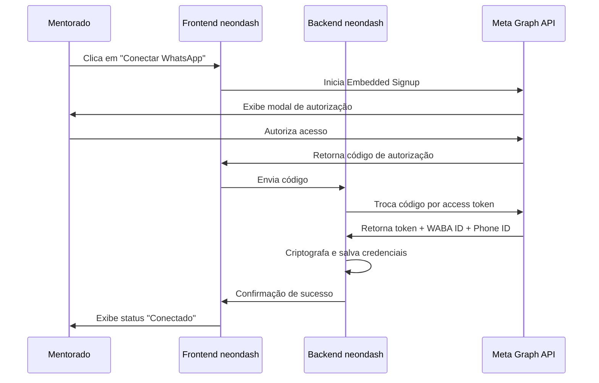

# Plano de Migração: Z API → Meta WhatsApp Cloud API

**Projeto**: neondash  
**Autor**: Manus AI  
**Data**: 2026-02-06  
**Complexidade**: L6 (Arquitetura e Integração)  
**Tempo Estimado**: 3-5 dias de desenvolvimento

---

## Sumário Executivo

Este documento apresenta o plano completo para migrar a integração de WhatsApp do projeto **neondash** da solução não-oficial **Z API** para a **API oficial da Meta (WhatsApp Cloud API)**. A migração permitirá que mentorados cadastrem seus próprios números de telefone para comunicação com clientes de forma mais robusta, escalável e econômica.

A estratégia adotada é de **migração gradual com coexistência temporária**, minimizando riscos e permitindo validação incremental. O sistema continuará suportando Z API durante a transição, com desativação progressiva após validação completa da nova integração.

---

## 1. Contexto e Motivação

### 1.1. Situação Atual

O sistema neondash utiliza o **Z API**, uma solução de terceiros que funciona como intermediário entre a aplicação e o WhatsApp. A arquitetura atual possui:

- **Autenticação**: Instance ID + Token na URL
- **Conexão**: QR Code gerado via API do Z API
- **Custo**: Fixo por instância (não escala bem)
- **Limitação**: Uma instância = um número de telefone
- **Dependência**: Serviço de terceiros com possível descontinuação

### 1.2. Problemas Identificados

1. **Escalabilidade**: Custo cresce linearmente com número de usuários
2. **Confiabilidade**: Dependência de serviço não-oficial
3. **Features**: Limitado às funcionalidades que o Z API expõe
4. **Risco**: Possível descontinuação ou mudanças de preço

### 1.3. Solução Proposta

Migrar para a **Meta WhatsApp Cloud API**, que oferece:

- **API Oficial**: Suporte direto da Meta
- **Custo por Conversa**: Modelo mais escalável
- **Múltiplos Números**: Um WABA pode gerenciar vários números
- **Features Completas**: Acesso a todas as funcionalidades oficiais
- **Embedded Signup**: Onboarding simplificado para clientes

---

## 2. Comparação Técnica

### 2.1. Arquitetura

| Aspecto | Z API | Meta Cloud API |
|---------|-------|----------------|
| **Autenticação** | Instance ID + Token na URL | Bearer Token no header |
| **Base URL** | `api.z-api.io` | `graph.facebook.com` |
| **Endpoint Envio** | `/instances/{id}/token/{token}/send-text` | `/v23.0/{phone_id}/messages` |
| **Conexão** | QR Code via API | Configuração no Business Manager |
| **Webhook Format** | Custom Z-API format | Meta standard format |
| **Phone Management** | Um número por instância | Múltiplos números por WABA |

### 2.2. Funcionalidades

| Funcionalidade | Z API | Meta Cloud API |
|----------------|-------|----------------|
| Envio de mensagens texto | ✅ | ✅ |
| Envio de mídia | ✅ | ✅ |
| Templates | ✅ | ✅ |
| Webhooks (recebimento) | ✅ | ✅ |
| Status de mensagens | ✅ | ✅ |
| QR Code connection | ✅ | ❌ (via Business Manager) |
| Groups API | ❌ | ✅ |
| Calling API | ❌ | ✅ |
| Marketing Messages API | ❌ | ✅ |
| Embedded Signup | ❌ | ✅ |

### 2.3. Custo Estimado

**Z API:**
- R$ 50-100/mês por instância
- 100 mentorados = R$ 5.000-10.000/mês

**Meta Cloud API:**
- Primeiras 1.000 conversas/mês: Grátis
- R$ 0,10-0,50 por conversa adicional
- 100 mentorados com 50 conversas/mês cada = ~R$ 250-1.250/mês

**Economia estimada**: 75-90% de redução de custos

---

## 3. Arquitetura da Solução

### 3.1. Modelo de Dados

Adicionar novos campos à tabela `mentorados`:

```typescript
// Meta WhatsApp Cloud API Integration
metaWabaId: varchar("meta_waba_id", { length: 128 }),
metaPhoneNumberId: varchar("meta_phone_number_id", { length: 128 }),
metaAccessToken: text("meta_access_token"), // Encrypted
metaConnected: simNaoEnum("meta_connected").default("nao"),
metaConnectedAt: timestamp("meta_connected_at"),
metaPhoneNumber: varchar("meta_phone_number", { length: 20 }),
```

### 3.2. Estrutura de Arquivos

```
server/
├── services/
│   ├── zapiService.ts          # Existente - manter durante migração
│   └── metaApiService.ts       # NOVO - serviço Meta Cloud API
├── routers/
│   ├── zapiRouter.ts           # Existente - manter durante migração
│   └── metaApiRouter.ts        # NOVO - rotas tRPC para Meta API
└── webhooks/
    ├── zapiWebhook.ts          # Existente - manter durante migração
    └── metaWebhook.ts          # NOVO - handler webhooks Meta

client/src/components/whatsapp/
├── WhatsAppConnectionCard.tsx  # Existente - Z API
└── MetaConnectionCard.tsx      # NOVO - Meta API
```

### 3.3. Fluxo de Onboarding (Embedded Signup)



---

## 4. Plano de Implementação

### 4.1. Fase 1: Backend - Estrutura e Configuração

#### AT-001: Atualizar Schema do Banco de Dados

**Prioridade**: Crítica  
**Dependências**: Nenhuma  
**Tempo Estimado**: 1 hora

**Descrição**: Adicionar novos campos à tabela `mentorados` para armazenar credenciais da Meta API.

**Implementação**:
1. Editar `drizzle/schema.ts`
2. Adicionar campos listados na seção 3.1
3. Executar `bun run drizzle:generate`
4. Revisar SQL gerado
5. Executar `bun run drizzle:migrate`

**Validação**:
```bash
# Verificar se migração foi aplicada
bun run drizzle:studio
# Confirmar que novos campos existem na tabela mentorados
```

**Rollback**:
```sql
ALTER TABLE mentorados 
DROP COLUMN meta_waba_id,
DROP COLUMN meta_phone_number_id,
DROP COLUMN meta_access_token,
DROP COLUMN meta_connected,
DROP COLUMN meta_connected_at,
DROP COLUMN meta_phone_number;
```

---

#### AT-002: Criar Novo Serviço `metaApiService.ts`

**Prioridade**: Alta  
**Dependências**: AT-001  
**Tempo Estimado**: 3 horas

**Descrição**: Criar serviço para encapsular toda a lógica de comunicação com a Meta Cloud API.

**Implementação**:

```typescript
// server/services/metaApiService.ts

const META_GRAPH_API_VERSION = "v23.0";
const META_GRAPH_API_BASE = `https://graph.facebook.com/${META_GRAPH_API_VERSION}`;

export interface MetaApiCredentials {
  accessToken: string;
  phoneNumberId: string;
}

export interface MetaSendMessageRequest {
  to: string;
  message: string;
}

export interface MetaSendMessageResponse {
  messaging_product: "whatsapp";
  contacts: Array<{ input: string; wa_id: string }>;
  messages: Array<{ id: string }>;
}

/**
 * Enviar mensagem de texto via Meta Cloud API
 */
export async function sendTextMessage(
  credentials: MetaApiCredentials,
  { to, message }: MetaSendMessageRequest
): Promise<MetaSendMessageResponse> {
  const url = `${META_GRAPH_API_BASE}/${credentials.phoneNumberId}/messages`;
  
  const response = await fetch(url, {
    method: "POST",
    headers: {
      "Authorization": `Bearer ${credentials.accessToken}`,
      "Content-Type": "application/json",
    },
    body: JSON.stringify({
      messaging_product: "whatsapp",
      recipient_type: "individual",
      to: normalizePhoneNumber(to),
      type: "text",
      text: { body: message },
    }),
  });

  if (!response.ok) {
    const error = await response.text();
    throw new Error(`Meta API request failed (${response.status}): ${error}`);
  }

  return response.json();
}

/**
 * Normalizar número de telefone (remover formatação)
 */
export function normalizePhoneNumber(phone: string): string {
  let digits = phone.replace(/\D/g, "");
  
  // Adicionar código do Brasil se não presente
  if (!digits.startsWith("55") && digits.length <= 11) {
    digits = `55${digits}`;
  }
  
  return digits;
}

export const metaApiService = {
  sendTextMessage,
  normalizePhoneNumber,
};
```

**Validação**:
```typescript
// Teste unitário
import { metaApiService } from "./metaApiService";

const credentials = {
  accessToken: process.env.META_TEST_TOKEN,
  phoneNumberId: process.env.META_TEST_PHONE_ID,
};

const result = await metaApiService.sendTextMessage(credentials, {
  to: "+5511999999999",
  message: "Teste de integração",
});

console.assert(result.messages[0].id, "Message ID should be returned");
```

**Rollback**: Excluir arquivo `server/services/metaApiService.ts`

---

#### AT-003: Adicionar Variáveis de Ambiente

**Prioridade**: Alta  
**Dependências**: AT-002  
**Tempo Estimado**: 30 minutos

**Descrição**: Configurar variáveis de ambiente necessárias para a integração com Meta API.

**Implementação**:

Adicionar ao `.env`:
```bash
# Meta WhatsApp Cloud API
META_APP_ID=751534357596165
META_APP_SECRET=615e75c97772199c28df9d6946da46dd
META_WEBHOOK_VERIFY_TOKEN=EAAKrhDpryAUBQusym1w6ZCNmtn81MraDbU5pdTDKD88NlFx1XCLeZCoxZCrWPusYCMYW16pZBim1fdeSumQUrvsT3acjHQ3y0KkhcpXLpX3YK8PZAV2E8XUFP870SGaDvRXZBQv5bO7VBZAIP8d0OnxnzDBuP9j1GQtacILP6bTcWx5zaWSjlvOl79QtwCYcJXoSAZDZD
META_SYSTEM_USER_ACCESS_TOKEN=EAAKrhDpryAUBQusym1w6ZCNmtn81MraDbU5pdTDKD88NlFx1XCLeZCoxZCrWPusYCMYW16pZBim1fdeSumQUrvsT3acjHQ3y0KkhcpXLpX3YK8PZAV2E8XUFP870SGaDvRXZBQv5bO7VBZAIP8d0OnxnzDBuP9j1GQtacILP6bTcWx5zaWSjlvOl79QtwCYcJXoSAZDZD
```

Adicionar ao `.env.example`:
```bash
# Meta WhatsApp Cloud API Configuration
META_APP_ID=
META_APP_SECRET=
META_WEBHOOK_VERIFY_TOKEN=
META_SYSTEM_USER_ACCESS_TOKEN=
```

**Validação**:
```typescript
// Verificar se variáveis são lidas corretamente
console.log("META_APP_ID:", process.env.META_APP_ID);
console.log("META_WEBHOOK_VERIFY_TOKEN:", process.env.META_WEBHOOK_VERIFY_TOKEN);
```

**Rollback**: Remover variáveis do `.env`

---

### 4.2. Fase 2: Backend - Webhooks

#### AT-004: Criar Rota de Webhook em `metaWebhook.ts`

**Prioridade**: Crítica  
**Dependências**: AT-003  
**Tempo Estimado**: 2 horas

**Descrição**: Criar endpoint para receber webhooks da Meta (verificação e processamento).

**Implementação**:

```typescript
// server/webhooks/metaWebhook.ts

import type { Router } from "express";
import { createLogger } from "../_core/logger";

const logger = createLogger({ service: "metaWebhook" });

/**
 * Verificação do webhook (GET request)
 * Meta envia um challenge que deve ser retornado
 */
function verifyWebhook(req: any, res: any) {
  const mode = req.query["hub.mode"];
  const token = req.query["hub.verify_token"];
  const challenge = req.query["hub.challenge"];

  const verifyToken = process.env.META_WEBHOOK_VERIFY_TOKEN;

  if (mode === "subscribe" && token === verifyToken) {
    logger.info("Webhook verified successfully");
    res.status(200).send(challenge);
  } else {
    logger.error("Webhook verification failed");
    res.sendStatus(403);
  }
}

/**
 * Processar webhook (POST request)
 */
async function handleWebhook(req: any, res: any) {
  try {
    const body = req.body;

    // Verificar se é um webhook do WhatsApp
    if (body.object !== "whatsapp_business_account") {
      return res.sendStatus(404);
    }

    // Processar cada entry
    for (const entry of body.entry) {
      for (const change of entry.changes) {
        if (change.field === "messages") {
          await handleMessageChange(change.value);
        }
      }
    }

    res.sendStatus(200);
  } catch (error) {
    logger.error("Error processing webhook", { error });
    res.sendStatus(500);
  }
}

/**
 * Processar mudanças de mensagens
 */
async function handleMessageChange(value: any) {
  // Mensagens recebidas
  if (value.messages) {
    for (const message of value.messages) {
      await handleIncomingMessage(message, value.metadata);
    }
  }

  // Status de mensagens
  if (value.statuses) {
    for (const status of value.statuses) {
      await handleMessageStatus(status);
    }
  }
}

async function handleIncomingMessage(message: any, metadata: any) {
  logger.info("Incoming message", { messageId: message.id });
  // Implementação em AT-005
}

async function handleMessageStatus(status: any) {
  logger.info("Message status update", { messageId: status.id, status: status.status });
  // Implementação em AT-006
}

/**
 * Registrar rotas de webhook
 */
export function registerMetaWebhooks(router: Router): void {
  router.get("/webhooks/meta/whatsapp", verifyWebhook);
  router.post("/webhooks/meta/whatsapp", handleWebhook);
}
```

**Validação**:
```bash
# Testar verificação do webhook
curl "https://neondash.com.br/webhooks/meta/whatsapp?hub.mode=subscribe&hub.verify_token=EAAKrhDpryAUBQusym1w6ZCNmtn81MraDbU5pdTDKD88NlFx1XCLeZCoxZCrWPusYCMYW16pZBim1fdeSumQUrvsT3acjHQ3y0KkhcpXLpX3YK8PZAV2E8XUFP870SGaDvRXZBQv5bO7VBZAIP8d0OnxnzDBuP9j1GQtacILP6bTcWx5zaWSjlvOl79QtwCYcJXoSAZDZD&hub.challenge=TEST"
# Deve retornar: TEST

# Testar recebimento de payload
curl -X POST http://localhost:3000/webhooks/meta/whatsapp \
  -H "Content-Type: application/json" \
  -d '{
    "object": "whatsapp_business_account",
    "entry": [{
      "id": "123",
      "changes": [{
        "field": "messages",
        "value": {
          "messaging_product": "whatsapp",
          "metadata": {
            "phone_number_id": "123456"
          },
          "messages": [{
            "from": "5511999999999",
            "id": "wamid.test",
            "timestamp": "1234567890",
            "type": "text",
            "text": {"body": "Teste"}
          }]
        }
      }]
    }]
  }'
```

**Rollback**: Excluir arquivo `server/webhooks/metaWebhook.ts`

---

#### AT-005: Implementar Lógica de Recebimento de Mensagens

**Prioridade**: Alta  
**Dependências**: AT-004  
**Tempo Estimado**: 2 horas

**Descrição**: Processar mensagens recebidas via webhook e salvar no banco de dados.

**Implementação**:

```typescript
// Adicionar ao metaWebhook.ts

import { eq } from "drizzle-orm";
import { mentorados, whatsappMessages, leads } from "../../drizzle/schema";
import { getDb } from "../db";
import { sseService } from "../services/sseService";

async function handleIncomingMessage(message: any, metadata: any) {
  const db = getDb();
  
  // Encontrar mentorado pelo phone_number_id
  const [mentorado] = await db
    .select()
    .from(mentorados)
    .where(eq(mentorados.metaPhoneNumberId, metadata.phone_number_id))
    .limit(1);

  if (!mentorado) {
    logger.warn("Mentorado not found for phone_number_id", { 
      phoneNumberId: metadata.phone_number_id 
    });
    return;
  }

  // Extrair conteúdo da mensagem
  let content = "";
  if (message.type === "text") {
    content = message.text.body;
  } else {
    content = `[${message.type} message]`;
  }

  // Normalizar telefone do remetente
  const normalizedPhone = message.from;

  // Buscar lead associado
  const allLeads = await db
    .select()
    .from(leads)
    .where(eq(leads.mentoradoId, mentorado.id));

  const lead = allLeads.find(l => 
    l.telefone && phonesMatch(l.telefone, normalizedPhone)
  );

  // Salvar mensagem
  const [savedMessage] = await db
    .insert(whatsappMessages)
    .values({
      mentoradoId: mentorado.id,
      leadId: lead?.id ?? null,
      phone: normalizedPhone,
      direction: "inbound",
      content,
      zapiMessageId: message.id, // Reutilizar campo para Meta message ID
      status: "delivered",
      isFromAi: "nao",
    })
    .returning();

  // Broadcast via SSE
  sseService.broadcast(mentorado.id, "message", {
    id: savedMessage.id,
    phone: normalizedPhone,
    leadId: lead?.id ?? null,
    direction: "inbound",
    content,
    status: "delivered",
    createdAt: savedMessage.createdAt,
  });

  logger.info("Message saved", { messageId: message.id });
}

function phonesMatch(phone1: string, phone2: string): boolean {
  const normalized1 = phone1.replace(/\D/g, "");
  const normalized2 = phone2.replace(/\D/g, "");
  return normalized1.slice(-8) === normalized2.slice(-8);
}
```

**Validação**:
```bash
# Enviar mensagem de teste via webhook
# Verificar no banco de dados se a mensagem foi salva
SELECT * FROM whatsapp_messages ORDER BY created_at DESC LIMIT 1;
```

**Rollback**: Comentar função `handleIncomingMessage`

---

#### AT-006: Implementar Lógica de Atualização de Status

**Prioridade**: Média  
**Dependências**: AT-005  
**Tempo Estimado**: 1 hora

**Descrição**: Processar atualizações de status de mensagens enviadas.

**Implementação**:

```typescript
// Adicionar ao metaWebhook.ts

async function handleMessageStatus(status: any) {
  const db = getDb();
  
  const statusMap: Record<string, "sent" | "delivered" | "read" | "failed"> = {
    sent: "sent",
    delivered: "delivered",
    read: "read",
    failed: "failed",
  };

  const mappedStatus = statusMap[status.status];
  if (!mappedStatus) return;

  // Atualizar status no banco de dados
  const [updated] = await db
    .update(whatsappMessages)
    .set({ status: mappedStatus })
    .where(eq(whatsappMessages.zapiMessageId, status.id))
    .returning({ 
      mentoradoId: whatsappMessages.mentoradoId, 
      id: whatsappMessages.id 
    });

  // Broadcast via SSE
  if (updated) {
    sseService.broadcast(updated.mentoradoId, "status_update", {
      messageId: updated.id,
      zapiMessageId: status.id,
      status: mappedStatus,
    });
  }

  logger.info("Message status updated", { 
    messageId: status.id, 
    status: mappedStatus 
  });
}
```

**Validação**:
```bash
# Enviar mensagem
# Verificar se status é atualizado de "sent" para "delivered" para "read"
SELECT id, status, created_at FROM whatsapp_messages WHERE id = <message_id>;
```

**Rollback**: Comentar função `handleMessageStatus`

---

### 4.3. Fase 3: Backend - API e Rotas

#### AT-007: Criar `metaApiRouter.ts` com Rotas tRPC

**Prioridade**: Alta  
**Dependências**: AT-002  
**Tempo Estimado**: 2 horas

**Descrição**: Criar rotas tRPC para o frontend interagir com a Meta API.

**Implementação**:

```typescript
// server/metaApiRouter.ts

import { z } from "zod";
import { eq } from "drizzle-orm";
import { protectedProcedure, router } from "./_core/trpc";
import { getDb } from "./db";
import { mentorados, whatsappMessages } from "../drizzle/schema";
import { encrypt, safeDecrypt } from "./services/crypto";
import { metaApiService, type MetaApiCredentials } from "./services/metaApiService";

/**
 * Obter mentorado com credenciais Meta
 */
async function getMentoradoWithMeta(userId: number) {
  const db = getDb();
  const [mentorado] = await db
    .select()
    .from(mentorados)
    .where(eq(mentorados.userId, userId))
    .limit(1);

  return mentorado ?? null;
}

/**
 * Construir credenciais Meta a partir dos dados do mentorado
 */
function buildMetaCredentials(mentorado: {
  metaAccessToken: string | null;
  metaPhoneNumberId: string | null;
}): MetaApiCredentials | null {
  if (!mentorado.metaAccessToken || !mentorado.metaPhoneNumberId) {
    return null;
  }

  const decryptedToken = safeDecrypt(mentorado.metaAccessToken);
  if (!decryptedToken) {
    return null;
  }

  return {
    accessToken: decryptedToken,
    phoneNumberId: mentorado.metaPhoneNumberId,
  };
}

export const metaApiRouter = router({
  /**
   * Obter status da conexão Meta
   */
  getStatus: protectedProcedure.query(async ({ ctx }) => {
    const mentorado = await getMentoradoWithMeta(ctx.user.id);
    if (!mentorado) {
      return { configured: false, connected: false };
    }

    const credentials = buildMetaCredentials(mentorado);
    if (!credentials) {
      return { configured: false, connected: false };
    }

    return {
      configured: true,
      connected: mentorado.metaConnected === "sim",
      phone: mentorado.metaPhoneNumber,
      wabaId: mentorado.metaWabaId,
    };
  }),

  /**
   * Configurar credenciais Meta (após Embedded Signup)
   */
  configure: protectedProcedure
    .input(
      z.object({
        wabaId: z.string().min(1),
        phoneNumberId: z.string().min(1),
        accessToken: z.string().min(1),
        phoneNumber: z.string().optional(),
      })
    )
    .mutation(async ({ ctx, input }) => {
      const mentorado = await getMentoradoWithMeta(ctx.user.id);
      if (!mentorado) {
        throw new Error("Mentorado não encontrado");
      }

      const encryptedToken = encrypt(input.accessToken);

      const db = getDb();
      await db
        .update(mentorados)
        .set({
          metaWabaId: input.wabaId,
          metaPhoneNumberId: input.phoneNumberId,
          metaAccessToken: encryptedToken,
          metaConnected: "sim",
          metaConnectedAt: new Date(),
          metaPhoneNumber: input.phoneNumber ?? null,
          updatedAt: new Date(),
        })
        .where(eq(mentorados.id, mentorado.id));

      return { success: true };
    }),

  /**
   * Desconectar Meta API
   */
  disconnect: protectedProcedure.mutation(async ({ ctx }) => {
    const mentorado = await getMentoradoWithMeta(ctx.user.id);
    if (!mentorado) {
      throw new Error("Mentorado não encontrado");
    }

    const db = getDb();
    await db
      .update(mentorados)
      .set({
        metaConnected: "nao",
        updatedAt: new Date(),
      })
      .where(eq(mentorados.id, mentorado.id));

    return { success: true };
  }),

  // Implementação de sendMessage em AT-008
  // Implementação de getMessages similar ao zapiRouter
});
```

**Validação**:
```typescript
// Testar via tRPC client
const status = await trpc.metaApi.getStatus.query();
console.log(status); // { configured: false, connected: false }
```

**Rollback**: Excluir arquivo `server/metaApiRouter.ts`

---

#### AT-008: Implementar Rota de Envio de Mensagem

**Prioridade**: Alta  
**Dependências**: AT-007  
**Tempo Estimado**: 1 hora

**Descrição**: Adicionar rota para enviar mensagens via Meta API.

**Implementação**:

```typescript
// Adicionar ao metaApiRouter.ts

sendMessage: protectedProcedure
  .input(
    z.object({
      phone: z.string().min(8),
      message: z.string().min(1),
      leadId: z.number().optional(),
    })
  )
  .mutation(async ({ ctx, input }) => {
    const mentorado = await getMentoradoWithMeta(ctx.user.id);
    if (!mentorado) {
      throw new Error("Mentorado não encontrado");
    }

    const credentials = buildMetaCredentials(mentorado);
    if (!credentials) {
      throw new Error("Meta API não configurada");
    }

    // Enviar mensagem via Meta API
    const response = await metaApiService.sendTextMessage(credentials, {
      phone: input.phone,
      message: input.message,
    });

    // Salvar mensagem no banco de dados
    const db = getDb();
    const [savedMessage] = await db
      .insert(whatsappMessages)
      .values({
        mentoradoId: mentorado.id,
        leadId: input.leadId ?? null,
        phone: input.phone,
        direction: "outbound",
        content: input.message,
        zapiMessageId: response.messages[0].id,
        status: "sent",
        isFromAi: "nao",
      })
      .returning();

    return {
      success: true,
      messageId: savedMessage.id,
      metaMessageId: response.messages[0].id,
    };
  }),
```

**Validação**:
```typescript
// Testar envio de mensagem
const result = await trpc.metaApi.sendMessage.mutate({
  phone: "+5511999999999",
  message: "Teste de envio via Meta API",
});
console.log(result); // { success: true, messageId: 123, metaMessageId: "wamid..." }
```

**Rollback**: Comentar rota `sendMessage`

---

#### AT-009: Implementar Rota de Status da Conexão

**Prioridade**: Média  
**Dependências**: AT-007  
**Tempo Estimado**: 30 minutos

**Descrição**: Adicionar rota para verificar status detalhado da conexão.

**Implementação**:

```typescript
// Adicionar ao metaApiRouter.ts

getConnectionDetails: protectedProcedure.query(async ({ ctx }) => {
  const mentorado = await getMentoradoWithMeta(ctx.user.id);
  if (!mentorado) {
    return null;
  }

  return {
    wabaId: mentorado.metaWabaId,
    phoneNumberId: mentorado.metaPhoneNumberId,
    phoneNumber: mentorado.metaPhoneNumber,
    connected: mentorado.metaConnected === "sim",
    connectedAt: mentorado.metaConnectedAt,
  };
}),
```

**Validação**:
```typescript
const details = await trpc.metaApi.getConnectionDetails.query();
console.log(details);
```

**Rollback**: Comentar rota `getConnectionDetails`

---

### 4.4. Fase 4: Frontend - Onboarding e UI

#### AT-010: Criar Componente `MetaConnectionCard.tsx`

**Prioridade**: Alta  
**Dependências**: AT-009  
**Tempo Estimado**: 2 horas

**Descrição**: Criar componente de UI para gerenciar conexão com Meta API.

**Implementação**:

```typescript
// client/src/components/whatsapp/MetaConnectionCard.tsx

import { useState } from "react";
import { Card, CardHeader, CardTitle, CardDescription, CardContent } from "@/components/ui/card";
import { Button } from "@/components/ui/button";
import { Badge } from "@/components/ui/badge";
import { trpc } from "@/lib/trpc";
import { CheckCircle2, XCircle, Loader2 } from "lucide-react";

export function MetaConnectionCard() {
  const [loading, setLoading] = useState(false);
  const utils = trpc.useContext();
  
  const { data: status } = trpc.metaApi.getStatus.useQuery();
  const disconnectMutation = trpc.metaApi.disconnect.useMutation({
    onSuccess: () => {
      utils.metaApi.getStatus.invalidate();
    },
  });

  const handleConnect = () => {
    // Implementação do Embedded Signup em AT-011
    console.log("Iniciar Embedded Signup");
  };

  const handleDisconnect = async () => {
    if (confirm("Deseja realmente desconectar o WhatsApp?")) {
      await disconnectMutation.mutateAsync();
    }
  };

  return (
    <Card>
      <CardHeader>
        <CardTitle className="flex items-center gap-2">
          WhatsApp Business (Meta API)
          {status?.connected && (
            <Badge variant="success" className="ml-2">
              <CheckCircle2 className="w-3 h-3 mr-1" />
              Conectado
            </Badge>
          )}
          {!status?.connected && status?.configured && (
            <Badge variant="warning">
              <XCircle className="w-3 h-3 mr-1" />
              Desconectado
            </Badge>
          )}
        </CardTitle>
        <CardDescription>
          Conecte seu número de WhatsApp Business para conversar com seus clientes
        </CardDescription>
      </CardHeader>
      <CardContent className="space-y-4">
        {status?.connected && (
          <div className="space-y-2">
            <p className="text-sm text-muted-foreground">
              Número conectado: <strong>{status.phone}</strong>
            </p>
            <Button 
              variant="destructive" 
              onClick={handleDisconnect}
              disabled={disconnectMutation.isLoading}
            >
              {disconnectMutation.isLoading && (
                <Loader2 className="w-4 h-4 mr-2 animate-spin" />
              )}
              Desconectar
            </Button>
          </div>
        )}

        {!status?.connected && (
          <Button onClick={handleConnect} disabled={loading}>
            {loading && <Loader2 className="w-4 h-4 mr-2 animate-spin" />}
            Conectar WhatsApp Business
          </Button>
        )}
      </CardContent>
    </Card>
  );
}
```

**Validação**:
```typescript
// Renderizar componente em uma página de teste
import { MetaConnectionCard } from "@/components/whatsapp/MetaConnectionCard";

export default function TestPage() {
  return (
    <div className="p-8">
      <MetaConnectionCard />
    </div>
  );
}
```

**Rollback**: Excluir arquivo `client/src/components/whatsapp/MetaConnectionCard.tsx`

---

#### AT-011: Implementar Fluxo de Embedded Signup

**Prioridade**: Crítica  
**Dependências**: AT-010  
**Tempo Estimado**: 4 horas

**Descrição**: Implementar o fluxo completo de Embedded Signup da Meta.

**Implementação**:

```typescript
// Adicionar ao MetaConnectionCard.tsx

const handleConnect = () => {
  setLoading(true);

  // Configuração do Embedded Signup
  const config = {
    appId: import.meta.env.VITE_META_APP_ID,
    version: "v23.0",
    xfbml: true,
  };

  // Carregar SDK do Facebook
  window.fbAsyncInit = function() {
    FB.init({
      appId: config.appId,
      autoLogAppEvents: true,
      xfbml: true,
      version: config.version,
    });

    // Iniciar Embedded Signup
    FB.login(
      function(response) {
        if (response.authResponse) {
          const code = response.authResponse.code;
          handleAuthCode(code);
        } else {
          console.error("User cancelled login or did not fully authorize.");
          setLoading(false);
        }
      },
      {
        config_id: import.meta.env.VITE_META_CONFIG_ID, // Configuration ID do Embedded Signup
        response_type: "code",
        override_default_response_type: true,
        extras: {
          setup: {
            // Configurações adicionais
          },
        },
      }
    );
  };

  // Carregar script do SDK
  (function(d, s, id) {
    var js,
      fjs = d.getElementsByTagName(s)[0];
    if (d.getElementById(id)) {
      return;
    }
    js = d.createElement(s);
    js.id = id;
    js.src = "https://connect.facebook.net/en_US/sdk.js";
    fjs.parentNode.insertBefore(js, fjs);
  })(document, "script", "facebook-jssdk");
};

const handleAuthCode = async (code: string) => {
  try {
    // Trocar código por access token no backend
    const response = await fetch("/api/meta/exchange-token", {
      method: "POST",
      headers: { "Content-Type": "application/json" },
      body: JSON.stringify({ code }),
    });

    const data = await response.json();

    // Salvar credenciais
    await trpc.metaApi.configure.mutate({
      wabaId: data.wabaId,
      phoneNumberId: data.phoneNumberId,
      accessToken: data.accessToken,
      phoneNumber: data.phoneNumber,
    });

    utils.metaApi.getStatus.invalidate();
    setLoading(false);
  } catch (error) {
    console.error("Error exchanging token:", error);
    setLoading(false);
  }
};
```

**Backend - Endpoint de troca de token**:

```typescript
// server/routers.ts - adicionar rota Express

router.post("/api/meta/exchange-token", async (req, res) => {
  try {
    const { code } = req.body;

    // Trocar código por access token
    const tokenResponse = await fetch(
      `https://graph.facebook.com/v23.0/oauth/access_token?` +
      `client_id=${process.env.META_APP_ID}&` +
      `client_secret=${process.env.META_APP_SECRET}&` +
      `code=${code}`
    );

    const tokenData = await tokenResponse.json();

    // Obter informações da WABA e Phone Number
    const wabaResponse = await fetch(
      `https://graph.facebook.com/v23.0/debug_token?` +
      `input_token=${tokenData.access_token}&` +
      `access_token=${process.env.META_APP_ID}|${process.env.META_APP_SECRET}`
    );

    const wabaData = await wabaResponse.json();

    res.json({
      accessToken: tokenData.access_token,
      wabaId: wabaData.data.granular_scopes[0].target_ids[0],
      phoneNumberId: wabaData.data.granular_scopes[1].target_ids[0],
      phoneNumber: null, // Será obtido posteriormente
    });
  } catch (error) {
    console.error("Error exchanging token:", error);
    res.status(500).json({ error: "Failed to exchange token" });
  }
});
```

**Validação**:
1. Clicar em "Conectar WhatsApp Business"
2. Completar fluxo de autorização da Meta
3. Verificar se credenciais foram salvas no banco de dados
4. Verificar se status mudou para "Conectado"

**Rollback**: Desativar botão de onboarding e remover endpoint `/api/meta/exchange-token`

---

#### AT-012: Atualizar UI de Chat para Suportar Meta API

**Prioridade**: Média  
**Dependências**: AT-008  
**Tempo Estimado**: 2 horas

**Descrição**: Modificar componentes de chat para detectar e usar Meta API quando disponível.

**Implementação**:

```typescript
// client/src/components/chat/LeadChatWindow.tsx

// Adicionar lógica para detectar qual API usar
const { data: zapiStatus } = trpc.zapi.getStatus.useQuery();
const { data: metaStatus } = trpc.metaApi.getStatus.useQuery();

const sendMessage = async (message: string) => {
  // Priorizar Meta API se conectada
  if (metaStatus?.connected) {
    await trpc.metaApi.sendMessage.mutate({
      phone: lead.telefone,
      message,
      leadId: lead.id,
    });
  } else if (zapiStatus?.connected) {
    await trpc.zapi.sendMessage.mutate({
      phone: lead.telefone,
      message,
      leadId: lead.id,
    });
  } else {
    throw new Error("Nenhuma API de WhatsApp configurada");
  }
};
```

**Validação**:
1. Abrir chat com um lead
2. Enviar mensagem
3. Verificar se mensagem foi enviada via Meta API
4. Verificar se mensagem aparece no chat do WhatsApp

**Rollback**: Reverter alterações em `LeadChatWindow.tsx`

---

### 4.5. Fase 5: Migração e Limpeza

#### AT-013: Criar Script de Migração para Mentorados Existentes

**Prioridade**: Baixa  
**Dependências**: AT-011  
**Tempo Estimado**: 2 horas

**Descrição**: Criar script para auxiliar migração de mentorados do Z API para Meta API.

**Implementação**:

```typescript
// scripts/migrate-to-meta-api.ts

import { getDb } from "../server/db";
import { mentorados } from "../drizzle/schema";
import { eq } from "drizzle-orm";

async function migrateToMetaApi() {
  const db = getDb();

  // Buscar mentorados com Z API configurado
  const mentoradosWithZapi = await db
    .select()
    .from(mentorados)
    .where(eq(mentorados.zapiConnected, "sim"));

  console.log(`Encontrados ${mentoradosWithZapi.length} mentorados com Z API`);

  for (const mentorado of mentoradosWithZapi) {
    console.log(`\n--- Mentorado: ${mentorado.nomeCompleto} ---`);
    console.log(`Email: ${mentorado.email}`);
    console.log(`Telefone Z API: ${mentorado.zapiPhone}`);
    console.log(`\nPara migrar, o mentorado deve:`);
    console.log(`1. Acessar a página de configurações`);
    console.log(`2. Clicar em "Conectar WhatsApp Business (Meta API)"`);
    console.log(`3. Completar o fluxo de Embedded Signup`);
    console.log(`4. Após conectar, testar envio de mensagens`);
    console.log(`5. Desconectar Z API quando confirmar que Meta API funciona`);
  }

  console.log(`\n✅ Script de migração concluído`);
}

migrateToMetaApi().catch(console.error);
```

**Validação**:
```bash
bun run scripts/migrate-to-meta-api.ts
```

**Rollback**: Não aplicável (script apenas informativo)

---

#### AT-014: Desativar Gradualmente a Integração com Z API

**Prioridade**: Baixa  
**Dependências**: AT-013  
**Tempo Estimado**: 1 hora

**Descrição**: Adicionar feature flag para desativar Z API para usuários específicos.

**Implementação**:

```typescript
// Adicionar campo ao schema
zapiDeprecated: simNaoEnum("zapi_deprecated").default("nao"),

// Atualizar zapiRouter.ts para verificar flag
export const zapiRouter = router({
  getStatus: protectedProcedure.query(async ({ ctx }) => {
    const mentorado = await getMentoradoWithZapi(ctx.user.id);
    
    if (mentorado?.zapiDeprecated === "sim") {
      return { 
        configured: false, 
        connected: false,
        deprecated: true,
        message: "Z API foi descontinuado. Por favor, use Meta WhatsApp Cloud API."
      };
    }
    
    // Lógica existente...
  }),
});
```

**Validação**:
```sql
-- Marcar mentorado como deprecated
UPDATE mentorados SET zapi_deprecated = 'sim' WHERE id = 1;

-- Verificar se UI mostra mensagem de descontinuação
```

**Rollback**: Remover campo `zapiDeprecated` do schema

---

#### AT-015: Remover Código Legado do Z API

**Prioridade**: Baixa  
**Dependências**: AT-014  
**Tempo Estimado**: 2 horas

**Descrição**: Remover arquivos e código relacionado ao Z API após migração completa.

**Implementação**:

```bash
# Arquivos a remover:
rm server/services/zapiService.ts
rm server/zapiRouter.ts
rm server/webhooks/zapiWebhook.ts
rm client/src/components/whatsapp/WhatsAppConnectionCard.tsx

# Remover campos do schema:
# - zapiInstanceId
# - zapiToken
# - zapiClientToken
# - zapiConnected
# - zapiConnectedAt
# - zapiPhone
# - zapiInstanceStatus
# - zapiInstanceDueDate
# - zapiInstanceCreatedAt
# - zapiManagedByIntegrator
```

**Validação**:
```bash
# Verificar se aplicação compila sem erros
bun run build

# Verificar se testes passam
bun test
```

**Rollback**: Reverter commit de remoção do código

---

## 5. Estratégia de Rollback Geral

Em caso de problemas graves durante a migração:

1. **Manter Z API ativo**: Não desativar Z API até confirmação de 100% de sucesso
2. **Feature flag**: Usar flag `metaApiEnabled` para ativar/desativar Meta API
3. **Backup de dados**: Fazer backup completo do banco de dados antes de cada fase
4. **Monitoramento**: Acompanhar logs e métricas de erro
5. **Rollback incremental**: Reverter fase por fase se necessário

---

## 6. Checklist de Validação Final

Antes de considerar a migração completa:

- [ ] Todos os mentorados conseguem fazer onboarding via Embedded Signup
- [ ] Envio de mensagens funciona via Meta API
- [ ] Recebimento de mensagens funciona via webhooks
- [ ] Status de mensagens é atualizado corretamente
- [ ] UI de chat funciona com ambas as APIs
- [ ] Webhooks estão configurados e validados no Meta App Dashboard
- [ ] Variáveis de ambiente estão documentadas
- [ ] Testes automatizados cobrem funcionalidades críticas
- [ ] Documentação para mentorados foi criada
- [ ] Monitoramento e alertas estão configurados

---

## 7. Próximos Passos

Após a conclusão da migração:

1. **Otimizações**:
   - Implementar cache de access tokens
   - Adicionar retry logic para falhas de API
   - Implementar rate limiting

2. **Features Adicionais**:
   - Suporte a mensagens de mídia (imagens, vídeos, documentos)
   - Templates de mensagens
   - Mensagens interativas (botões, listas)
   - Groups API
   - Calling API

3. **Monitoramento**:
   - Dashboard de métricas de uso
   - Alertas de falhas de webhook
   - Relatórios de custos

4. **Documentação**:
   - Guia de onboarding para mentorados
   - Troubleshooting guide
   - FAQ

---

## 8. Referências

1. [Meta WhatsApp Business Platform - Overview](https://developers.facebook.com/documentation/business-messaging/whatsapp/overview)
2. [WhatsApp Cloud API - Get Started](https://developers.facebook.com/documentation/business-messaging/whatsapp/get-started)
3. [Webhooks - Meta for Developers](https://developers.facebook.com/documentation/business-messaging/whatsapp/webhooks/overview/)
4. [Messages API - Meta for Developers](https://developers.facebook.com/documentation/business-messaging/whatsapp/reference/whatsapp-business-phone-number/message-api)
5. [Embedded Signup - Meta for Developers](https://developers.facebook.com/documentation/business-messaging/whatsapp/embedded-signup/overview/)

---

**Documento criado por**: Manus AI  
**Data**: 2026-02-06  
**Versão**: 1.0
